# StrataWP SEO

<p align="center">
  <a href="https://github.com/JonImmsWordpressDev/stratawp-seo/releases/latest/download/stratawp-seo.zip">
    
  </a>
</p>

<p align="center">
  <sub>One-click download of the latest production-ready zip. Always points to the most recent release —
  rebuilt automatically on every push.</sub>
</p>

<p align="center">
  <a href="https://github.com/JonImmsWordpressDev/stratawp-seo/releases">All releases</a> ·
  <a href="#installation">Install instructions</a> ·
  <a href="#how-to-guide-page-by-page">How-to guide</a>
</p>

---

**AI-powered SEO that knows your WordPress site — and knows how AI search works.** Generate site-aware blog posts, run your technical SEO (sitemaps, redirects, schema `@graph`, audits, a full site crawler), get *cited* by AI answer engines (AEO scoring, llms.txt, AI citation tracking, AI referral analytics), and let the automation layer watch your budget, your decaying posts, and your topic pipeline while you sleep.

[]()
[]()
[]()
[](https://www.gnu.org/licenses/gpl-2.0.html)
[](https://buymeacoffee.com/jonimmswordpressdev)

---

## Table of Contents

- [What This Plugin Does](#what-this-plugin-does)
- [Feature Tour](#feature-tour)
  - [The AI Content Engine](#the-ai-content-engine)
  - [The AI Visibility & AEO Layer](#the-ai-visibility--aeo-layer)
  - [The Technical SEO Suite](#the-technical-seo-suite)
  - [The Automation & Insight Layer](#the-automation--insight-layer)
- [Installation](#installation)
- [Quick Start](#quick-start)
- [How-To Guide: Page by Page](#how-to-guide-page-by-page)
- [Configuration Guide](#configuration-guide)
- [Admin Pages](#admin-pages)
- [WP-CLI Commands](#wp-cli-commands)
- [REST API](#rest-api)
- [Developer Reference (Hooks)](#developer-reference)
- [Architecture](#architecture)
- [How Each Subsystem Works](#how-each-subsystem-works)
- [Privacy & Data](#privacy--data)
- [FAQ](#frequently-asked-questions)
- [Changelog](#changelog)
- [License](#license)

---

## What This Plugin Does

StrataWP SEO is four products in one plugin:

1. **An AI content engine** — site-aware blog posts (Anthropic, OpenAI, Google, xAI) with internal linking, FAQ schema, key takeaways, TOC, featured/in-content images, reusable voice profiles, content scoring, and a review-first Auto-Optimize loop for the posts you've already published.
2. **An AI visibility & AEO layer** — the differentiator. Every post is scored on 4 AI-citeability dimensions (including a live question-coverage checklist), robots.txt access and a dynamic `llms.txt` are managed for 15 known AI crawlers, and three analytics surfaces close the loop: which AI bots crawl you, which AI assistants send you human visitors, and whether ChatGPT, Claude, Gemini, and Grok actually *cite* you — all joined into one crawl → visit → citation funnel.
3. **A complete technical SEO suite** — XML sitemaps, redirect manager, breadcrumbs, a unified schema.org `@graph` with author E-E-A-T entities, per-post meta editor, search appearance templates, archive SEO, a 10-module audit, a politeness-capped site crawler with one-click fixes, keyword cannibalization detection, verified search-bot analytics with spoof detection, Local SEO, Image SEO, and one-click migration from Yoast / Rank Math.
4. **An automation & insight layer** — the Autopilot Guardian keeps AI spend under a monthly budget cap and retries transient failures, the white-label email digest reports to you (or your clients), the content decay watchdog flags posts losing clicks and queues reviewed AI refreshes, the data-driven Topic Autopilot proposes what to write next from your own Search Console data, and Machine Access exposes 13 governed abilities to AI agents via the WP Abilities API and REST.

It's designed to **replace** Yoast/RankMath/AIOSEO if you want to, or **coexist** with them (schema and meta output auto-disable when those plugins are detected).

---

## Feature Tour

### The AI Content Engine

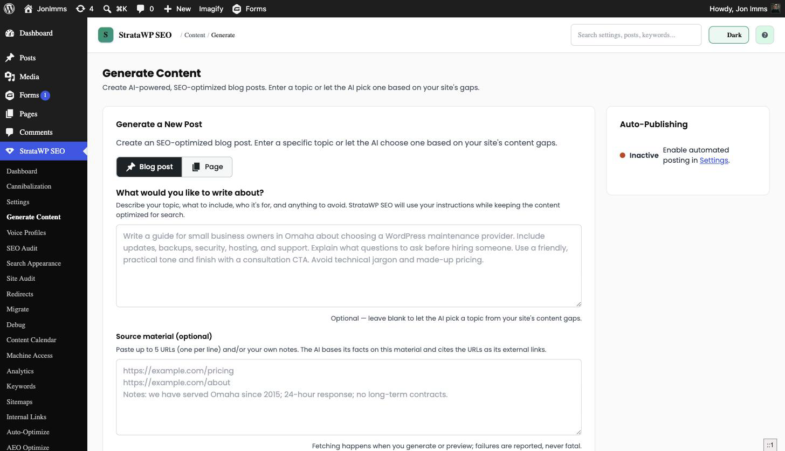

#### AI Content Generation
- **Multi-provider AI** — Anthropic (Claude), OpenAI (GPT), Google (Gemini), xAI (Grok); model lists are discovered live from each provider's API and refreshed daily, with dynamic labels (Most powerful, Cheapest, Costs most, Best value) and a dismissible new-model alert
- **Site-aware generation** — analyzes existing posts, categories, and internal links before writing
- **7 content templates** — Auto, Listicle, How-To Guide, Comparison, Case Study, News Analysis, Tutorial
- **Voice profiles** — reusable writing personas (tone, formality 1-10, sentence length, vocabulary, person, avoid/preferred phrases, sample text)
- **FAQ, Key Takeaways, TOC** — generated with `FAQPage` / `ItemList` schema and an auto-linked table of contents
- **Quality gates built in** — duplicate detection, content scoring with an optional draft-hold floor, rate limiting, and per-provider/model token + USD cost tracking (new models auto-priced via family heuristics)

#### Featured & In-Content Images
- **4 image providers** — Unsplash, Pexels, Pixabay (free stock), Gemini (AI-generated; image model auto-discovered)
- **Auto featured image** plus **1-4 in-content images** with derived alt text and configurable max width
- **Background image jobs** — each image runs as its own background job (Action Scheduler, WP-Cron fallback), so scheduled posts get their images reliably; failures appear in Recent Activity

#### Automated Publishing
- **Flexible scheduling** — daily through monthly cadences, with a topic queue and a visual content calendar
- **Bulk generation** — up to 5 posts in one click; long-running work runs through the background processor
- **Proposed topics on the calendar** — Topic Autopilot proposals arrive as a distinct "proposed" status with approve/dismiss controls (see [the automation layer](#the-automation--insight-layer))

#### AI Auto-Optimize
- **Re-score all published posts** in chunks with live progress; posts below your threshold (default 75) queue up
- **AI proposals with diff review** — concrete find/replace edits, optional new meta title/description/focus keyword, and a projected score; check/uncheck each edit before applying
- **One-click apply** with automatic re-score, plus per-row dismiss

### The AI Visibility & AEO Layer

This is the part Yoast doesn't have: a full pipeline for getting your content **cited by AI answer engines** — and proof of whether it's working.

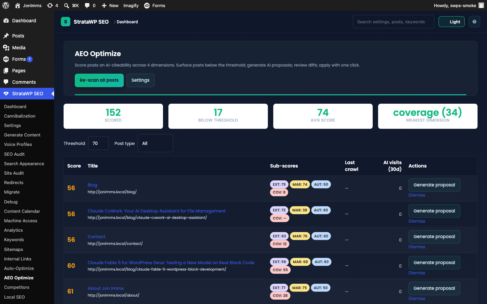

#### AEO Optimize
- **AEO Score with 4 dimensions** — Extractability, Markup, Authority, and a live **Coverage** dimension: one AI call builds a query fan-out checklist (the 5-10 sub-questions an answer engine would decompose your topic into, marked answered / partial / missing, cached by content hash)
- **Bulk AEO Optimize page** — chunked re-scan, threshold filter, per-row AI proposal with diff review, apply with snapshot/undo
- **Live editor panel** — Gutenberg sidebar + classic metabox with the score, sub-scores, your per-post crawl→visit funnel, unanswered searcher questions, and lost-citation context
- **Dynamic schema generation** — HowTo, Recipe, Product, Review, FAQPage JSON-LD, validated before output; defers to Yoast / RankMath / AIOSEO
- **Question demand mining** — a weekly GSC cron finds real question queries your pages get impressions for but don't answer, feeds Q&A inserts into AEO proposals, and queues uncovered questions as topic suggestions

#### AI Crawler Access & llms.txt
- **AI bot allowlist** — robots.txt `Allow`/`Disallow` rules for 15 known AI crawlers (GPTBot, ClaudeBot, PerplexityBot, Google-Extended, Applebot-Extended, CCBot, Bytespider, …)
- **Dynamic llms.txt** at `/llms.txt`, built from your posts/pages/categories with one-line summaries — plus an in-admin editor for both `/llms.txt` (Auto/Custom) and `/robots.txt` (Auto/Append/Replace)
- **IndexNow batch submission** — instant Bing/Yandex indexing (Bing's IndexNow feed powers ChatGPT search)

#### AI Bot Analytics, AI Referrals & the Visibility Funnel
- **AI Bot Analytics** — server-side hit tracking for the 15 AI crawlers: per-bot dashboards, top crawled pages, recent bot 404s, and an AEO gap report sortable by AEO score (high-quality-but-uncrawled posts first)
- **AI referral attribution** — human visits from ChatGPT, Perplexity, Claude, Gemini, Copilot, Grok, DeepSeek, Meta AI, and You.com are classified at capture; the AI Referrals analytics section shows engine trends, landing posts, and engagement vs organic
- **Crawl → visit funnel** — AI-bot crawl data joined to AI referral visits per post, with crawl-recency and AI-visit columns on the AEO queue and a dashboard funnel tile (posts crawled → posts receiving AI visits over 30 days, with stage conversion rates)

#### AI Citation Tracker
- **Search-grounded citation checks** — asks ChatGPT, Claude, Gemini, and Grok your tracked prompts (bring your own keys) and records whether your site is cited in the answer
- **Per-engine state badges** (cited / lost / never / mixed), **share-of-voice bars vs competitors**, and a **cited-domains breakdown** showing who *is* getting cited
- **Seed prompts from your keywords or GSC queries**, a monthly call cap (default 200) so spend stays bounded, a dashboard tile, and lost-citation context surfaced in the AEO editor panel and proposals

### The Technical SEO Suite

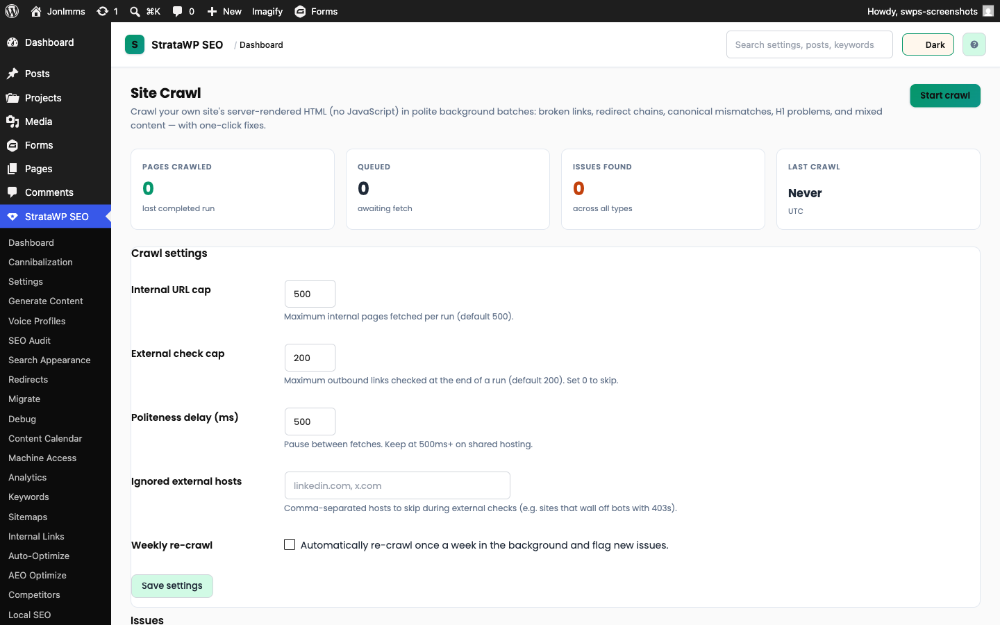

#### Technical SEO Audit
- **10 audit modules** — Canonical URLs, XML Sitemap, Open Graph, Twitter Cards, Robots.txt, Meta Robots, Image SEO, Page Speed Hints, Schema Validation (live-page JSON-LD checks), and Site Crawl results
- **Auto-fix** for canonical/OG/Twitter/sitemap issues, scheduled runs, dashboard health score, CSV export

#### Site Crawler
- **Politeness-capped self-crawl** — page caps (default 500 internal / 200 external link checks) and a configurable delay, run in chunks from the admin, with an optional weekly re-crawl
- **8 issue types** — broken links, redirect chains, redirect loops, canonical mismatches, missing H1, duplicate H1s, mixed content, and noindexed URLs still in the sitemap
- **One-click fixes** — create a redirect, exclude from sitemap, or ignore an external host, right from the issue row

#### Keyword Cannibalization Detector
- **GSC-driven findings** — surfaces queries where multiple posts split impressions and clicks, with a winner/loser per finding and an estimated impact
- **Three resolutions** — **Consolidate** (creates an undoable 301 to the winner), **Differentiate** (re-target the loser), or **Canonicalize** — plus dismiss
- Dashboard tile with the open-findings count

#### Schema / Structured Data
- **Unified `@graph`** — Organization, WebSite, WebPage, Article, BreadcrumbList, Person, and ProfilePage emitted as one interlinked JSON-LD block with stable `@id`s
- **Author E-E-A-T entities** — per-user profile fields (job title, credentials, sameAs links) feed Person schema and a ProfilePage on author archives
- **Schema validation audit module** — samples live pages and checks required fields, orphaned `@id` references, and date consistency
- **FAQPage + ItemList** from generated content, **LocalBusiness** via Local SEO, **HowTo/Recipe/Product/Review** via AEO
- **Conflict detection** — defers automatically when Yoast / RankMath / AIOSEO is active

#### Verified Crawler Analytics & Crawl Budget
- **Search-bot tracking** — Googlebot, Googlebot-Image, bingbot, Applebot, YandexBot, and DuckDuckBot tracked alongside the AI bots (search bots are analytics-only and never written to robots.txt or llms.txt)
- **Spoof detection** — every search-bot hit is verified against the engines' published CIDR ranges (refreshed by cron) with a reverse-DNS fallback; verdicts: verified / spoofed / unverifiable
- **Daily reconciliation notices** when spoofing spikes, and an opt-in, **fail-open 403 enforcement** for verified-spoofed bots (unverifiable hits always pass through — Googlebot can never be blocked by a stale IP list)
- **Crawl budget report** — Analytics-page breakdown of crawl activity by post type (30d) so you can see where bots spend their time

#### Sitemaps, Redirects & the Meta Layer
- **Full sitemap system** — `/sitemap_index.xml` with post type / taxonomy / author sub-sitemaps, image entries, per-sitemap exclusion toggles, IndexNow batch submit
- **Redirect manager** — 301/302/307/410 with exact + regex matching, 404 monitoring with one-click redirect creation, auto-redirect on slug change
- **Internal links engine** — keyword and AI engines with an accept/skip review UI
- **SEO meta editor** — per-post title/description/canonical/robots/OG/Twitter with live SERP preview, SEO checklist, and an AI Generate button
- **Search appearance templates**, per-term taxonomy meta, frontend breadcrumbs with schema, RSS before/after content, wp_head cleanup

#### Local SEO & Image SEO
- **Local SEO** — LocalBusiness JSON-LD with 30+ business types, NAP, opening hours, geo coordinates, area served, Google Place ID, and a live schema preview
- **Image SEO** — auto-alt on upload (free heuristic or AI mode), device-prefix filename sanitization, lazy-loading enforcement, and a bulk fix tool for the existing library

#### Research & Off-Site
- **Keywords** — AI keyword suggestions, GSC rank tracking, striking-distance opportunities (positions 8-20)
- **Competitor watch** — up to 10 sites with daily diffs of new posts, schema types, and title/H1 changes, plus content velocity
- **Backlinks** — manual/CSV tracker (GSC "Top linking sites" exports auto-detected) with daily live/lost/broken verification — no paid index required
- **Analytics** — cookie-free on-site tracking (views, time, scroll depth, bounce) + GSC OAuth in one dashboard

#### Migration Tool
- **One-click import from Yoast SEO (incl. Premium) and Rank Math (incl. Pro)** — per-post meta, global settings, and redirects, with a dry-run preview, skip/overwrite conflict policy, and one-click undo

### The Automation & Insight Layer

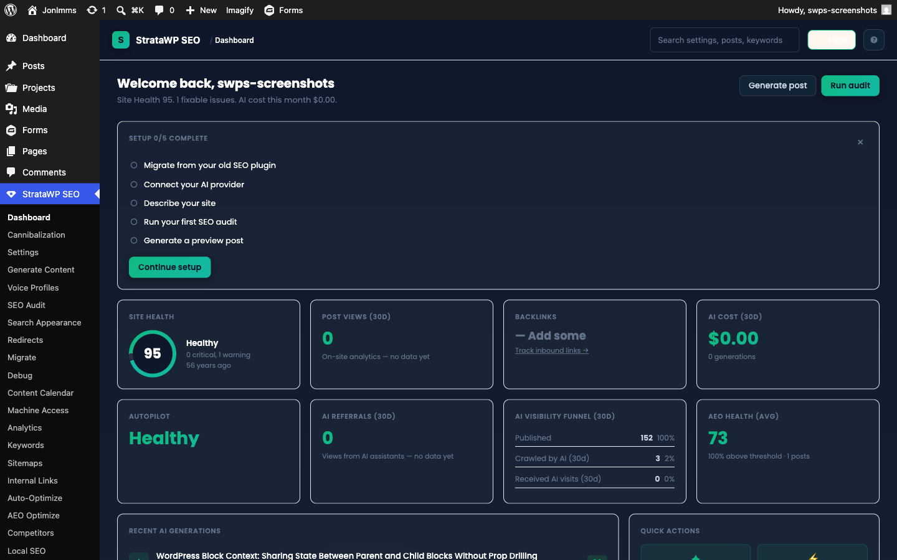

#### Autopilot Guardian
- **Monthly AI budget cap** (USD) with an 80% warning notice and a hard stop at the cap
- **Transient-error retry** with exponential backoff — a single failed generation no longer abandons the rest of a scheduled batch
- **Failed-topic auto-requeue** (max 3 attempts per topic) and a dashboard autopilot tile showing enabled state, last-run health, and spend vs cap

#### White-Label Email Digest
- **Daily / weekly / monthly** report of generations, failures, keyword movers, backlinks, competitors, AI-bot trends, and AI spend — led by a needs-attention triage section
- **Agency branding** (logo, accent color, footer text), multiple recipients, a test-send button, and an optional AI executive summary

#### Content Decay Watchdog & Refresh Queue
- **Weekly GSC scan** compares rolling 28-day windows per post and flags decays past your threshold (default 20% click decline) with a heuristic cause — position drop, demand drop, CTR drop, or staleness
- **Metric + AEO-score history with sparklines**, a minimum-impressions floor, per-post cooldowns, and a one-email summary alert when top posts decay
- **Refresh Queue** ranked by traffic at risk, with one-click AI refresh proposals that always go through the reviewed AEO apply/undo flow

#### Data-Driven Topic Autopilot
- **Weekly scout** mines GSC question queries, striking-distance keywords, and orphan pages into ranked, deduplicated topic proposals — each with a plain-English rationale
- **Approve or dismiss on the Content Calendar** (proposals are a distinct "proposed" status), or enable **auto-promote** to queue the top proposal automatically

#### Machine Access (WP Abilities API)
- **13 governed abilities** — queue topics, generate posts, run audits, AEO scan/propose/apply/undo, add/delete redirects, and read stats — registered with the WP Abilities API (WordPress 6.9+) and exposed via REST (`/swps/v1/abilities`)
- **Write abilities are off by default** — every ability has its own toggle, and every call (allowed or denied) lands in an activity log
- **Standard WordPress auth** — application passwords work out of the box for external agents

#### 5-Minute Onboarding
- **Setup Wizard** — migrate from Yoast/Rank Math, validate your AI key with a live test call, AI-suggest your site description, run the first audit, and generate a preview post
- **Dashboard setup checklist** that persists until every step is done (dismissible)

#### Admin Shell & Developer Features
- **Branded admin shell** — top bar with breadcrumb, search, help, and a per-user dark/light theme toggle; Emerald & Teal design system
- **50+ filters and actions**, WP-CLI commands, REST API, encrypted secret storage (authenticated AES-256-GCM), a Debug page for failed AI responses, and an opt-in clean uninstall (your data survives delete + reinstall by default)

---

## Installation

### From WordPress Admin
1. Download the plugin ZIP file
2. Go to **Plugins → Add New → Upload Plugin**
3. Upload the ZIP and click **Install Now**
4. Click **Activate**

### Manual Installation
1. Upload the `stratawp-seo` folder to `/wp-content/plugins/`
2. Activate through the **Plugins** menu

### Requirements
- WordPress 6.0 or higher
- PHP 8.0 or higher
- An API key from at least one AI provider (Anthropic, OpenAI, Google, or xAI)

---

## Quick Start

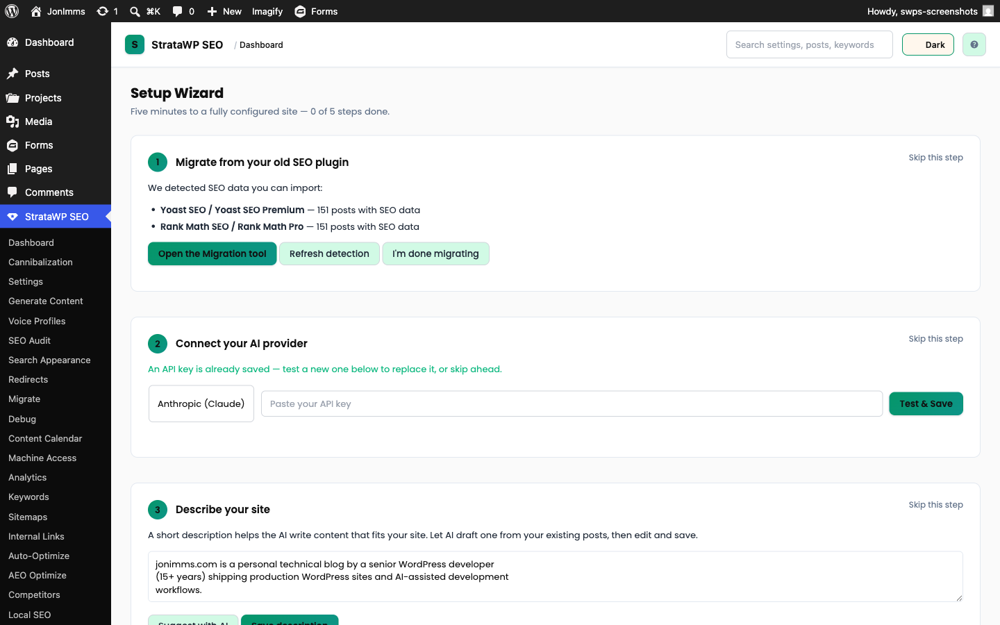

The fastest route is the **Setup Wizard** (`StrataWP SEO → Setup Wizard`) — it launches on first activation and takes about five minutes:

1. **Migrate** — if Yoast or Rank Math data is detected, import it (or skip)
2. **API key** — pick an AI provider, paste your key, and validate it with a live test call
3. **Site info** — describe your site and audience, or let the AI suggest a description for you
4. **First audit** — run the 10-module technical SEO audit
5. **Preview post** — generate a sample post so you can judge the output before enabling anything automatic

A setup checklist stays on the dashboard until every step is complete (dismiss it any time).

Prefer to do it by hand? The manual route:

1. **Add your API key** — **StrataWP SEO → Settings**, enter your AI provider API key (Anthropic recommended)
2. **Describe your site** — fill in **Site Niche** and **Site Description** so the AI understands your audience
3. **Set your preferences** — **Tone of Voice**, word count range, **Post Status: Draft** (recommended)
4. **(Optional) Allow AI crawlers** — the **AI Crawlers** section is enabled by default; visit `/llms.txt` to see your generated index
5. **Generate your first post** — **StrataWP SEO → Generate Content**, enter a topic, click **Generate**
6. **Review & publish** — edit the generated draft in WordPress, then publish

---

## How-To Guide: Page by Page

Every admin page in the plugin, what it does, and exactly how to use it. Pages are listed in the order they appear in the StrataWP admin sidebar.

### Dashboard (`StrataWP SEO`)


The landing page. Shows site health score, recent generations, AI cost (30d), post views, top GSC queries, top issues, the **Auto-Optimize queue preview**, the **Competitor watch widget**, and the newer tiles: **Autopilot status** (enabled state, last-run health, budget spend vs cap), the **AI visibility funnel** (posts crawled → posts receiving AI visits, 30d), **AI citations** (share of voice), and **Keyword cannibalization** (open findings). Until onboarding is finished, a **setup checklist** sits at the top. Each tile links to its source page — click "Manage →" on Competitor watch to jump straight to managing tracked sites.

**How to use it:** load it daily as a temperature check. The welcome line summarizes site health, fixable issues, and 30-day AI spend in one sentence. The KPI tiles use the brand emerald gradient for the four primary numbers. The modules grid at the bottom lets you toggle features on/off — turn off Sitemaps if you're using Yoast/RankMath's sitemap, for example.

### Setup Wizard (`StrataWP SEO → Setup Wizard`) ★ v4.13


Guided 5-step first-run flow: detect + migrate Yoast/Rank Math data, validate your AI API key with a live test call, describe your site (with an AI-suggest button), run the first audit, and generate a preview post.

**How to use it:** it opens automatically after activation; you can re-run it any time from the sidebar. Each step can be completed or skipped — progress is tracked per step, and the dashboard shows a setup checklist until all five are done (or you dismiss it). The preview post is created as a draft so nothing goes live.

### Settings (`StrataWP SEO → Settings`)

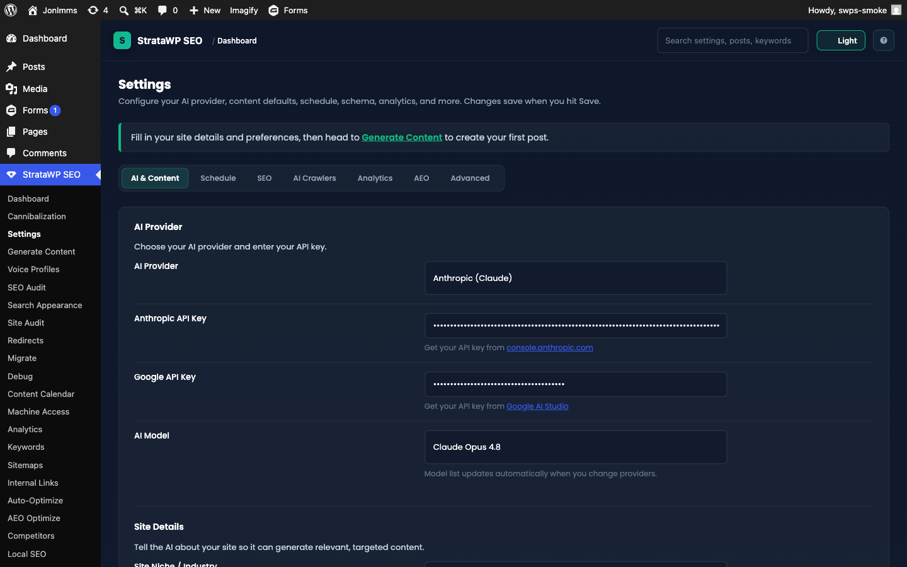

The control panel — split into 7 tabs:

- **AI & Content:** AI provider + API keys, model (auto-discovered daily since v4.9.0), site niche/description, writing preferences (tone, voice profile, style notes, target keywords), content settings (post status, word count, FAQ/TOC/Key Takeaways, internal links), featured & in-content images
- **Schedule:** auto-publishing frequency, day of week, time, posts per run, the **monthly AI budget cap** (Autopilot Guardian), and **Topic Autopilot** (weekly scout + auto-promote)
- **SEO:** audit auto-fixes + schedule, schema/structured data, SEO meta editor, head cleanup, RSS feed header/footer
- **AI Crawlers:** allowlist of 15 known bots, llms.txt toggle, **Crawler Verification** (proxy header, spoofed-crawler 403 enforcement), and **AI Citations** (check frequency, monthly call cap, engines)
- **Analytics:** on-site tracking, retention, exclude admins, GSC OAuth client ID/secret (stored encrypted), keyword sync frequency, the **Email Digest** (frequency, recipients, branding, AI summary, test-send), and the **Content Decay Watchdog** (threshold, minimum impressions, email alert)
- **AEO:** score threshold, coverage scoring (1 AI call/post), dynamic schema types, post types to score, dimension weights
- **Advanced:** default template, rate-limit cooldown, duplicate detection, cost tracking, minimum content score

### Generate Content (`StrataWP SEO → Generate Content`)


The main AI content generator.

1. Pick a **template** (Auto, Listicle, How-To, Comparison, Case Study, News Analysis, Tutorial)
2. Enter a **topic** (or leave blank to auto-pick from queue)
3. Optionally select a **voice profile** to lock the tone
4. Set **target word count** (or use the global default)
5. Click **Generate** — it'll analyze your site, draft, score, attach images, and save as a draft

**Tip:** if generation takes >2 min, the post is being processed in the background. Check the Calendar to see status.

### Voice Profiles (`StrataWP SEO → Voice Profiles`)

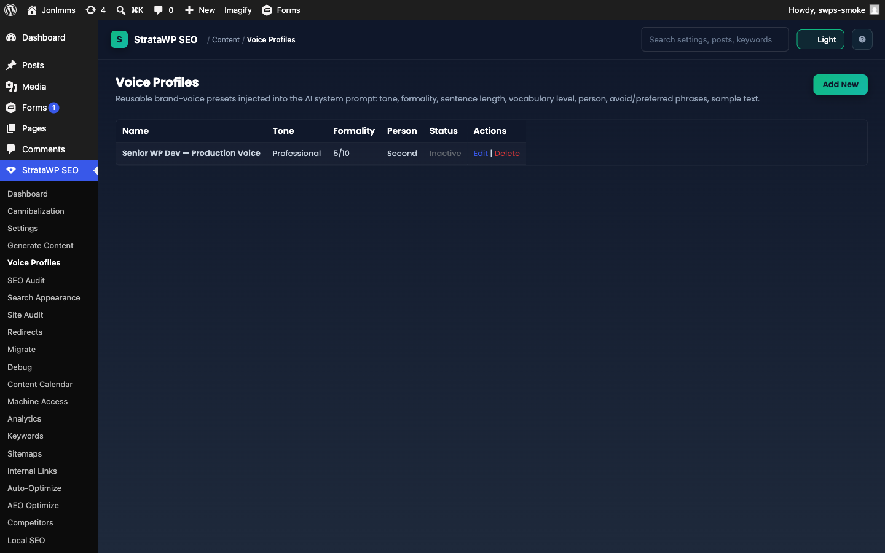

Reusable writing personas. Each profile sets tone, formality (1-10), preferred sentence length, vocabulary level, point of view, avoid/preferred phrases, and a sample text the AI emulates.

**How to use it:**
1. **Add new** → name it (e.g., "Friendly authority", "Conversational developer")
2. Paste a **sample paragraph** that matches the tone you want
3. Mark it **Default** if it should apply to every Generate without picking explicitly
4. In Generate Content, the dropdown lets you override per-post

### SEO Audit (`StrataWP SEO → SEO Audit`)

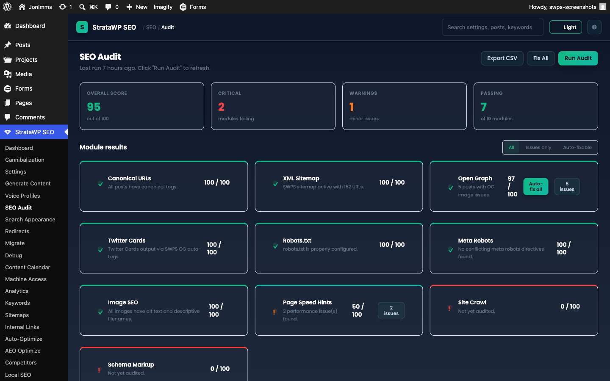

10-module technical SEO check. Each module reports pass/warn/critical with auto-fix where possible.

**How to use it:**
1. Click **Run audit now** — takes 2-10 seconds
2. Each module card shows status; click **Auto-fix** on any module that has it (canonical, OG, Twitter, sitemap)
3. **CSV export** for client reporting

Schedule daily/weekly/monthly runs from **Settings → SEO tab**. The dashboard widget shows the latest health score.

### Site Crawl (`StrataWP SEO → Site Crawl`) ★ v4.19


Crawls your own site the way a search engine would and queues fixable issues.

**How to use it:**
1. Check the **settings card** — internal page cap (default 500), external link-check cap (default 200), politeness delay, and the **weekly re-crawl** toggle
2. Click **Start crawl** — runs in AJAX chunks with live progress; you can leave the tab open while it works
3. Review the **issues table** — 8 issue types: broken links, redirect chains, redirect loops, canonical mismatches, missing H1, duplicate H1s, mixed content (http assets on https pages), and noindexed URLs still in the sitemap
4. Use the **one-click fixes** on each row: **Create redirect** (broken internal links), **Exclude from sitemap** (noindexed pages), or **Ignore host** (external false positives)
5. The latest run also appears as a read-only **Site Crawl** module inside the SEO Audit, so crawl health counts toward your site score

### Search Appearance (`StrataWP SEO → Search Appearance`)

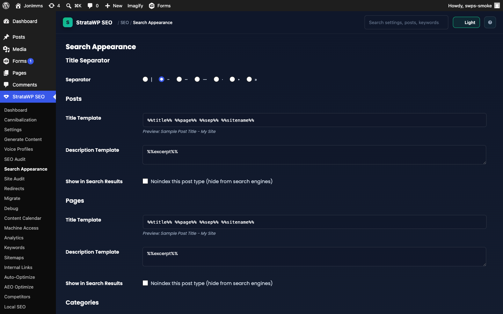

Controls how titles and descriptions appear in search results.

**How to use it:**
1. Set **separator** (`|`, `–`, `·`, etc.)
2. Edit per-content-type templates with variables: `%title%`, `%sitename%`, `%sep%`, `%category%`, `%author%`, `%date%`, etc.
3. Per-post overrides are still available in the post editor's **SEO Meta Editor** metabox

### Redirects (`StrataWP SEO → Redirects`)

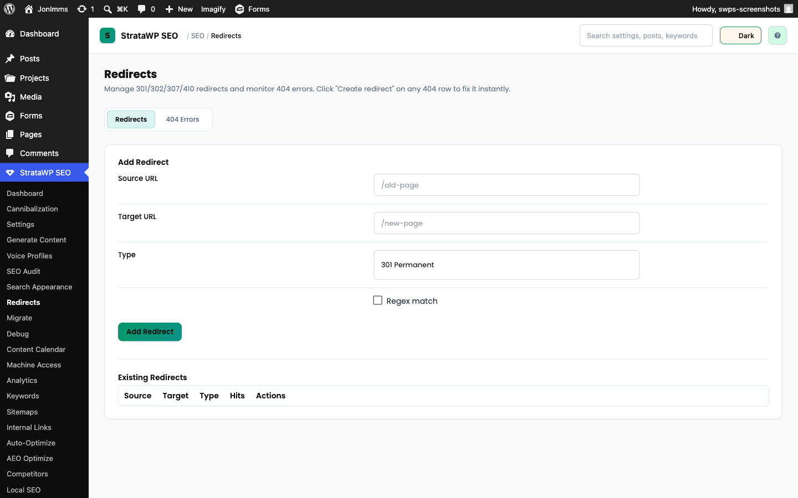

Manages 301/302/307/410 redirects and 404 monitoring.

**How to use it:**
1. **Add a redirect:** From URL → To URL → pick status code → Save
2. **Regex tab** for pattern-based redirects (`^/old/(.*)$ → /new/$1`)
3. **404 Log tab:** every unhandled 404 shows up here; click **Create redirect** to fix it in one click
4. **Auto-redirect on slug change:** enabled by default — when you change a post's slug, a redirect from the old slug is created automatically

### Migrate (`StrataWP SEO → Migrate`) ★ v4.4

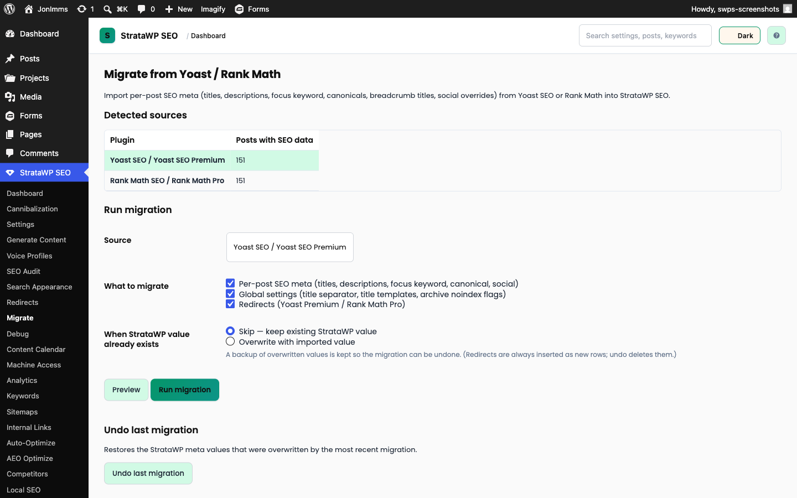

One-click import from Yoast SEO or Rank Math. Lives at `admin.php?page=swps-migration`.

**How to use it:**
1. The page auto-detects installed sources and shows how many posts have SEO data for each (if neither plugin left data behind, it says there is nothing to migrate).
2. Pick the **Source**, then tick what to migrate: **per-post SEO meta** (titles, descriptions, focus keyword, canonical, breadcrumb title, social overrides), **global settings** (title separator, title templates, archive noindex flags), and **redirects** (Yoast Premium / Rank Math Pro — 301/302/307/410, regex sources kept as regex).
3. Choose the **conflict policy** — *Skip* (keep existing StrataWP values, default) or *Overwrite* (a backup of overwritten values is kept).
4. Click **Preview** for a dry run (posts scanned, fields/settings/redirects that would be written), then **Run migration**.
5. **Undo last migration** restores overwritten values; imported redirects are deleted on undo.

### Debug (`StrataWP SEO → Debug`)

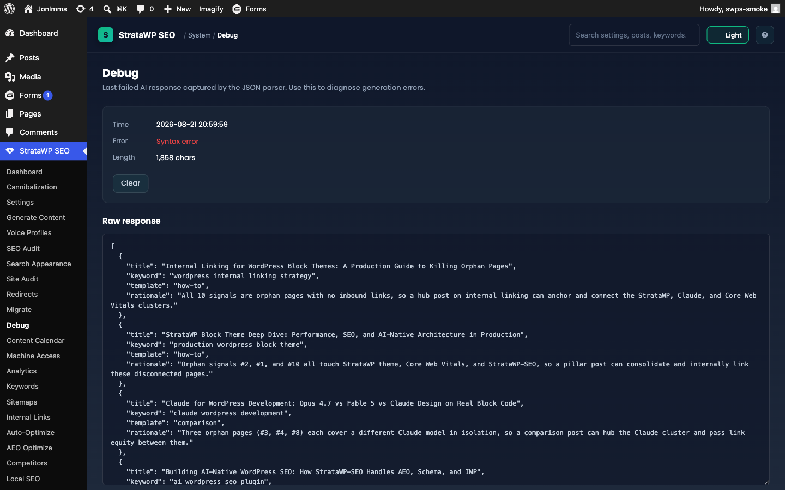

Shows the **last failed AI response** captured by the JSON parser (the page title is "Debug — Last AI Failure"). If a generation errored, this is the first place to look.

**How to use it:** the page shows the most recent failure automatically — Time, Error, and response Length, plus the full **Raw response** in a read-only textarea. If nothing has failed recently you'll see "No recent failures." Click **Clear** to discard the stored failure once you've diagnosed it.

### Content Calendar (`StrataWP SEO → Content Calendar`)

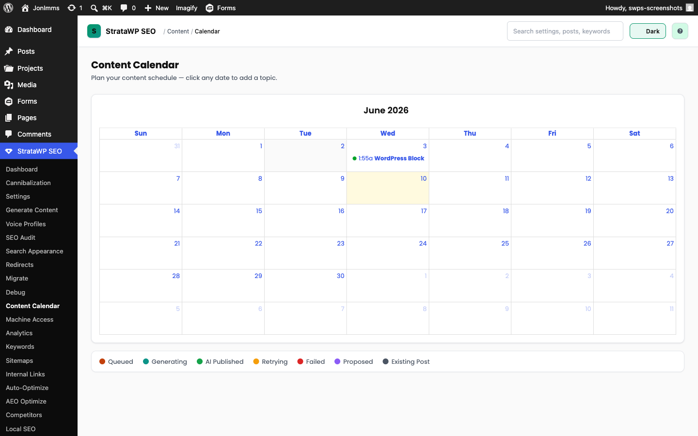

Visual month-view of every scheduled and generated post. Color-coded by status (draft, scheduled, published). Click any cell to see the post detail or jump to the editor.

**How to use it:** click any date to open the **topic form** (Topic/Headline, Scheduled Date, Content Template, Notes) — entries become the auto-publish queue. Add 10-20 topics with target dates, set **Settings → Schedule** to Daily/Weekly/etc., and the cron generates posts automatically, marking each queue entry as used. You can also manage the queue with `wp swps queue list|add|remove|clear` or the REST `/queue` endpoints. Drag-and-drop is not supported (yet) — to reschedule, edit the post and change its date.

**Proposed topics (Topic Autopilot) ★ v4.19:** when the weekly scout is enabled (Settings → Schedule → Topic Autopilot), data-backed topic proposals appear on the calendar in their own "proposed" color with the rationale that produced them (an unanswered GSC question, a striking-distance keyword, or an orphan page). Click a proposal to **Approve** it (it becomes a normal queued topic) or **Dismiss** it. With **auto-promote** enabled, the top proposal each week is queued automatically.

### Analytics (`StrataWP SEO → Analytics`)

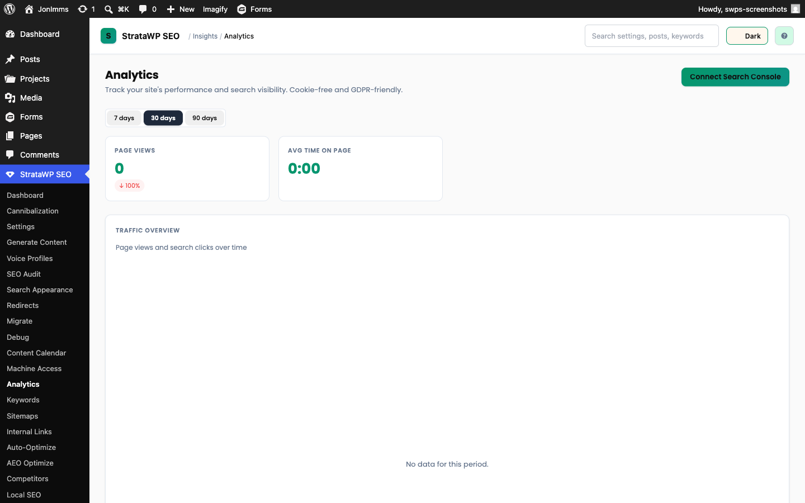

Cookie-free on-site analytics + GSC dashboard.

**How to use it:**
1. **Date range filter** at the top: 7 / 30 / 90 days
2. **Top stats:** Pageviews, Unique visitors, Avg time, Bounce rate
3. **Charts:** Pageviews over time, top posts, top referrers
4. **GSC tab:** clicks, impressions, CTR, position (requires OAuth setup — see below)
5. **AI Crawlers section:** total bot hits with delta, per-bot breakdown, top crawled pages, AEO gap report, recent bot 404s. Search bots (Googlebot, bingbot, Applebot, YandexBot, DuckDuckBot) are tracked here too, each hit verified against published IP ranges — spoofed hits are flagged, and daily reconciliation notices appear when spoofing spikes
6. **AI Referrals section ★ v4.14:** human visits arriving from ChatGPT, Perplexity, Claude, Gemini, Copilot and others — engine trend chart, top landing posts, and engagement vs organic comparison
7. **Crawl Budget by Post Type (30d) ★ v4.19:** where verified search bots actually spend their crawl budget, broken down by post type, so you can spot over-crawled archives and under-crawled money pages

**Connecting Google Search Console:**
1. **Settings → Analytics tab:** paste GSC OAuth client ID + secret (redirect URI shown in the field description)
2. **Analytics page:** click **Connect Search Console** in the page header → sign into Google → confirm scope → you land back on Settings with a connected notice
3. Back on the Analytics page, a notice lists your verified GSC properties — pick one from the dropdown and click **Save**
4. Data syncs on the configured Keyword Sync Frequency and surfaces in Dashboard, Analytics, and Keywords

### Keywords (`StrataWP SEO → Keywords`)

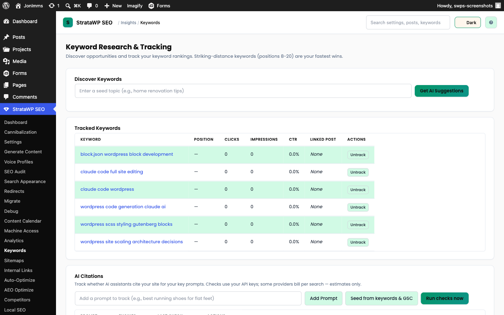

Keyword research + rank tracking.

**How to use it:**
1. **Generate keywords:** enter a seed topic, AI suggests 10-50 related keywords
2. **Track keywords:** add to the watchlist — GSC syncs daily and shows position trends
3. **Striking distance:** the "8-20" tab surfaces ranking opportunities — keywords you're already on page 2 for that could be pushed to page 1 with light optimization
4. **AI Citations card ★ v4.16:** track whether ChatGPT, Claude, Gemini, and Grok cite your site. Add prompts manually or **seed from your tracked keywords / GSC queries**, pick the engines to check (Settings → AI Crawlers → AI Citations; bring your own keys), and click **Run checks**. Each prompt shows per-engine state badges (cited / lost / never / mixed), a share-of-voice bar vs competitor domains, and a cited-domains breakdown. Checks are search-grounded and counted against a monthly call cap (default 200) so spend stays bounded

### Keyword Cannibalization (`StrataWP SEO → Keyword Cannibalization`) ★ v4.19

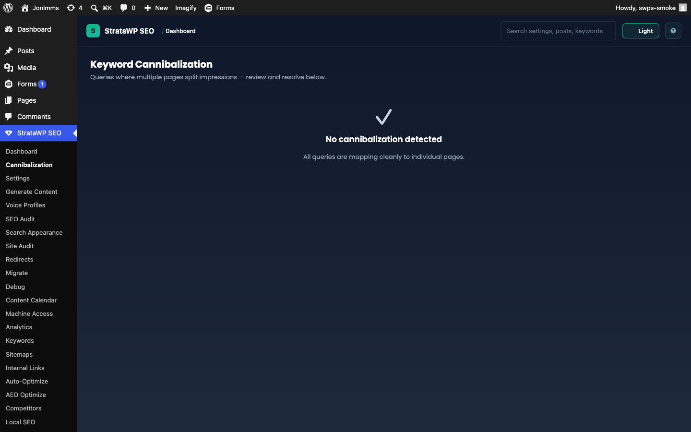

Finds queries where two or more of your posts split impressions and clicks in Google Search Console — usually a sign they're competing against each other.

**How to use it:**
1. Findings are produced by a weekly GSC scan (you can also trigger a scan from the page). Each finding shows the query, the **winner** (strongest post), the **losers**, and an estimated traffic impact based on an expected CTR-by-position curve
2. Pick a resolution per finding:
   - **Consolidate** — creates a 301 redirect from the loser to the winner via the Redirect Manager. **Undoable** — the redirect is tracked and can be reverted in one click
   - **Differentiate** — keep both posts but re-target the loser at a different keyword (links you into the editing flow)
   - **Canonicalize** — point the loser's canonical URL at the winner without redirecting
3. **Dismiss** findings you've judged intentional. Already-consolidated findings can't be double-consolidated
4. The dashboard tile shows the open-findings count

### Sitemaps (`StrataWP SEO → Sitemaps`)

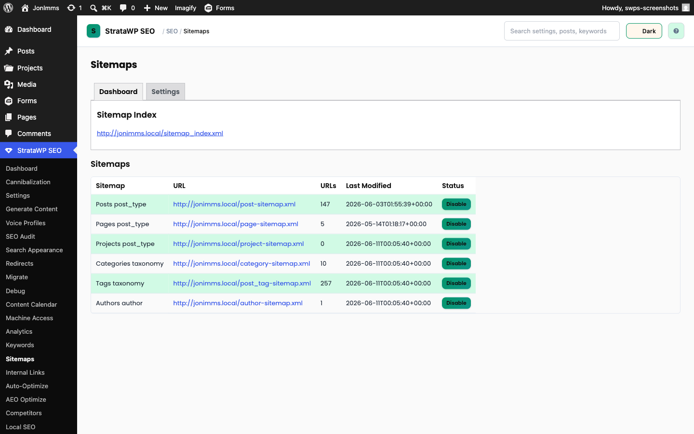

Configures `/sitemap_index.xml` and sub-sitemaps.

**How to use it:**
1. **Settings tab:** toggle individual post types/taxonomies in/out of the sitemap, set per-type priority and changefreq
2. **Submit tab:** the **Ping Search Engines** button submits 50 most-recently-modified posts to IndexNow (Bing/Yandex/Seznam — Bing's feed powers ChatGPT search). Use after a major content push.
3. **View raw:** click "View sitemap" to see the live XML

### Internal Links (`StrataWP SEO → Internal Links`)

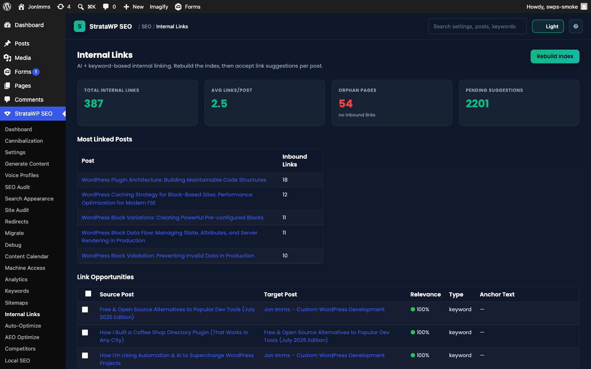

Suggests internal links from existing posts to other relevant posts on your site. Two engines:

- **Keyword engine:** finds anchor opportunities by keyword match
- **AI engine:** uses your AI provider for semantic suggestions

**How to use it:**
1. Pick a target post
2. Click **Find suggestions** — engine returns candidate anchors with confidence scores
3. Accept or skip each one — accepted links are inserted into the post body

### Auto-Optimize (`StrataWP SEO → Auto-Optimize`) ★ v4.1

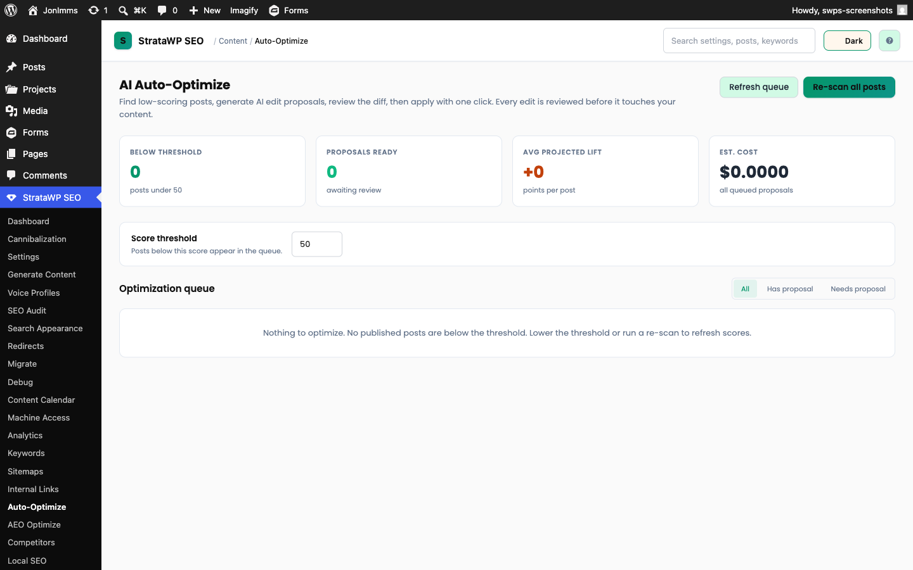

Finds underperforming published posts, generates AI proposals to fix them, and applies the edits with one click. Manual review queue — every edit is reviewed before it touches your content.

**How to use it:**
1. Click **Re-scan all posts** — scores all published posts/pages in batches of 10 (live progress bar). Posts below the threshold (default 75) appear in the queue.
2. For each row, click **Generate proposal** — AI returns 2-6 concrete `find/replace` edits, plus optional new meta title/description and focus keyword, plus a projected score
3. Click **Review** on a proposal — see the diff (red = old, green = new), check/uncheck individual edits, click **Apply selected edits**
4. Re-score happens automatically after apply — you'll see the new score

**Threshold tuning:** raise the threshold (e.g. 85) to surface more posts, lower it (e.g. 50) to focus only on the worst.

**Dismissing:** the trash icon hides a post from the queue permanently (snapshot history is kept).

### AEO Optimize (`StrataWP SEO → AEO Optimize`) ★ v4.6


Scores posts on 4 AI-citeability dimensions — Extractability, Markup, Authority, Coverage — and fixes weak ones with AI proposals. Lives at `admin.php?page=swps-aeo-optimize`.

**How to use it:**
1. Click **Re-scan all posts** — scores the configured post types in AJAX batches with a live progress bar. The tiles update with Scored / Below threshold / Avg score / Weakest dimension, and the queue persists across visits (scored posts reload from post meta).
2. Use the **Threshold** (50-95, default 70) and **Post type** filters to focus the queue on the worst offenders.
3. For each row, click **Generate proposal** — the AI returns concrete content edits plus optional JSON-LD (HowTo, Recipe, Product, Review, FAQPage).
4. Click **Review** — a modal shows the diff; apply with one click. **Undo** restores the pre-apply snapshot; dismiss hides a row from the queue.
5. The same AEO score appears live in the post editor (Gutenberg sidebar panel + classic metabox).

**Cost note:** the Coverage dimension uses one AI call per post (~$0.001-$0.003) — toggle it in **Settings → AEO**. Dynamic schema output defers automatically when Yoast / RankMath / AIOSEO is active.

**What's new in the queue and editor panel:** the Coverage dimension now produces a **sub-question checklist** (the fan-out questions an answer engine would ask, marked answered / partial / missing); the editor panel also lists **unanswered searcher questions** mined from GSC (real question queries your page gets impressions for but doesn't answer) and feeds them into Q&A proposal inserts; queue rows carry **crawl recency and AI-visit columns** so you can prioritize posts AI engines already look at; and **lost citations** from the citation tracker appear as context on affected posts.

### Refresh Queue (`StrataWP SEO → Refresh Queue`) ★ v4.18

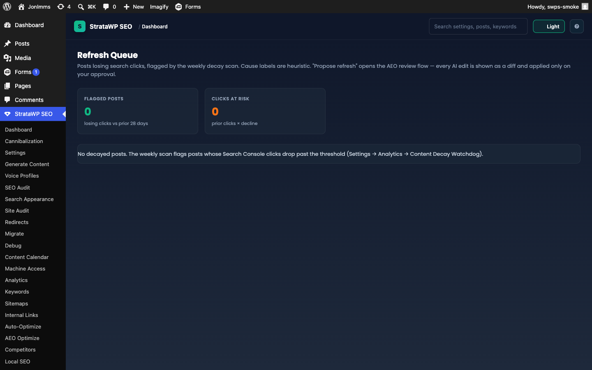

The content decay watchdog's work queue: posts losing search clicks, ranked by traffic at risk.

**How to use it:**
1. A weekly scan compares each post's rolling 28-day GSC window to the previous one. Posts declining past your threshold (default 20%, with a 200-impression floor — both in **Settings → Analytics**) are flagged with a heuristic cause: position drop, demand drop, CTR drop, or staleness
2. Each row shows **clicks and AEO-score sparklines** so you can see the shape of the decline
3. Click **Generate refresh proposal** — the AI proposes content updates targeted at the decay cause, reviewed in the same diff modal as AEO Optimize (apply with snapshot, undo any time)
4. **Dismiss** rows you don't want refreshed; dismissals have a cooldown so the same post doesn't instantly re-flag
5. Optional **email alert** (Settings → Analytics) sends a one-email summary when top posts decay

### Competitors (`StrataWP SEO → Competitors`) ★ v4.1

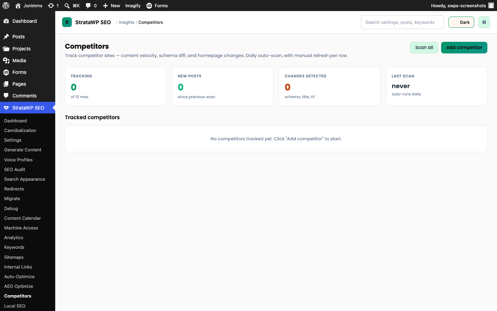

Tracks competitor sites for content velocity, schema diff, title/H1 changes.

**How to use it:**
1. Click **Add competitor** → paste the URL → optional label → Save
2. Click **Scan now** on the row — fetches their RSS (auto-discovered or common-path), homepage, and falls back to sitemap.xml if no feed
3. Daily WP-cron auto-rescans every tracked site
4. **+N new** pill on a row indicates new posts since last scan (click to expand the list)
5. **Schema:** chips show their JSON-LD types; new types are highlighted with a `+ NEW` indicator
6. **Title/H1 changed** pills appear when their homepage `<title>` or `<h1>` flipped between scans
7. Source pill (RSS / SITEMAP) shows which data source the scan succeeded with

**Limit:** 10 competitors. **Storage:** last 12 snapshots per competitor (~12 days of daily history). **Out of scope:** keyword-gap analysis (needs paid backlink API).

### Local SEO (`StrataWP SEO → Local SEO`) ★ v4.2

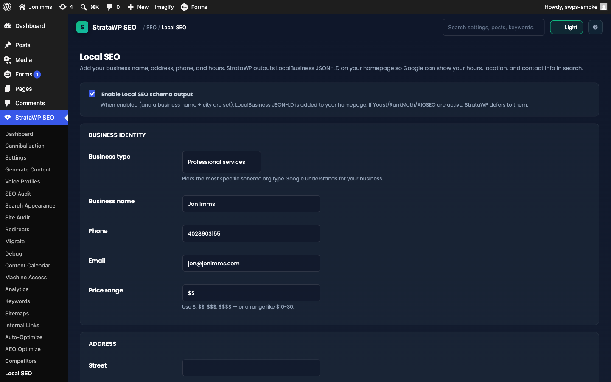

LocalBusiness JSON-LD output for brick-and-mortar and service-area sites. Lives at `admin.php?page=swps-local-seo`.

**How to use it:**
1. Tick **Enable Local SEO schema output** at the top of the page. Schema only emits when this is on AND a business name + city are filled.
2. Pick the most specific **Business type** that matches your business — Restaurant, Plumber, Dentist, Hotel, etc. (defaults to generic LocalBusiness). The picker covers 30+ schema.org sub-types.
3. Fill **Business identity**: name, phone, email, price range (`$`/`$$`/`$$$`/`$$$$` or a range like `$10-30`).
4. Fill **Address** fields: street, city, state/region, postal code, country (two-letter ISO preferred — `US`, `GB`, `AU`).
5. **Map & geo (optional but recommended for ranking):** open Google Maps, right-click your location, click the lat/lng to copy, paste into the Latitude/Longitude fields. Optionally paste your **Google Place ID** to emit a `hasMap` link.
6. **Opening hours:** for each day, set Open and Close in 24-hour format (`09:00`, `17:30`), or tick **Closed** for off-days. Days without hours are omitted from the schema.
7. **Area served** (service-area businesses): paste one city/region per line, up to 25.
8. Click **Save**. A **Schema preview** card renders at the bottom showing the exact JSON-LD that will be injected into your homepage `<head>`.
9. Verify the live output with Google's [Rich Results Test](https://search.google.com/test/rich-results) once the homepage is published.

**Coexistence:** if Yoast / RankMath / AIOSEO are active, StrataWP defers all schema output to them — turn this off and use their LocalBusiness panel instead.

### Image SEO (`StrataWP SEO → Image SEO`) ★ v4.2

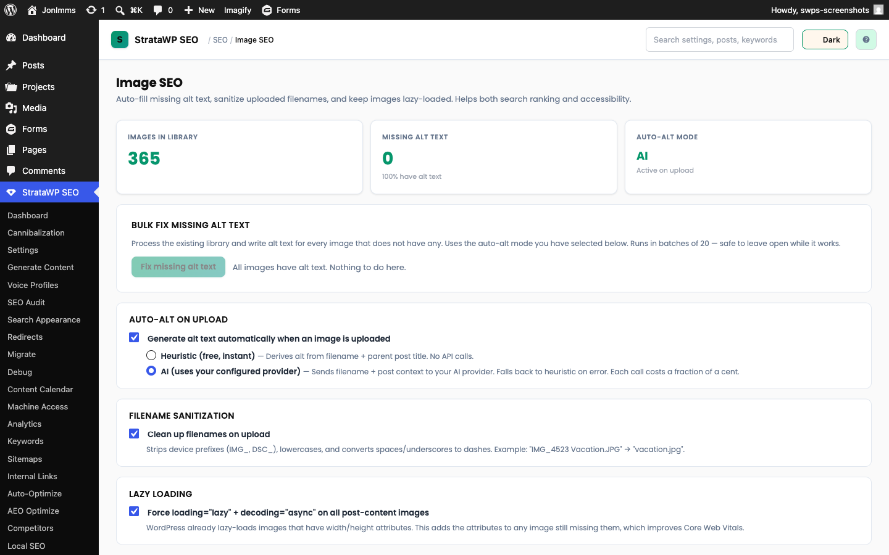

Auto-fills missing alt text, sanitizes filenames on upload, and enforces lazy-loading. Lives at `admin.php?page=swps-image-seo`.

**How to use it:**
1. Open the page — the **stats tiles** at the top show total library size, count missing alt text, % covered, and current auto-alt mode.
2. **Bulk fix existing library:** click the **Fix missing alt text** button to write alt for every image that doesn't have any. Runs in 20-image batches via AJAX so you can leave the tab open while it works. Uses the auto-alt mode you have selected below.
3. **Auto-alt on upload** card:
   - Tick **Generate alt text automatically when an image is uploaded** to enable.
   - Pick **Heuristic** (free, instant — derives alt from filename + parent post title) or **AI** (sends filename + post context to your configured AI provider for a one-line description; falls back to heuristic on error or quota).
4. **Filename sanitization** card: tick to clean filenames on upload — `IMG_4523 Vacation.JPG` becomes `vacation.jpg`. Strips device prefixes (`IMG_`, `DSC_`, `DSCN`, `Screenshot`, etc.).
5. **Lazy loading** card: tick to add `loading="lazy" decoding="async"` to any post-content `` still missing those attributes. Improves Core Web Vitals.
6. Click **Save Image SEO settings**.

**Tips:** AI mode costs a fraction of a cent per image (one short call to your configured provider). For most sites, Heuristic mode is plenty good — it's especially strong when your filenames already have meaningful slugs (e.g. `seo-checklist-2026.jpg`).

### Backlinks (`StrataWP SEO → Backlinks`) ★ v4.2

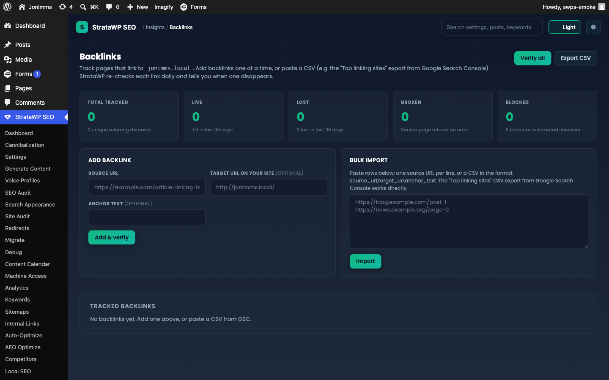

Tracks pages that link to your site, with daily health monitoring. Lives at `admin.php?page=swps-backlinks`. No paid backlink index required.

**How to seed your initial list:**
- **Option A — manual:** use the **Add backlink** form. Paste the source URL (the page linking to you), optionally the target URL on your site and the anchor text, then click **Add & verify**. The page is fetched immediately so you see Live/Lost/Broken right away.
- **Option B — CSV import (recommended):**
  1. Go to Google Search Console → **Links** → **Top linking sites** → click the export button → save as CSV.
  2. In the **Bulk import** card, paste the CSV (or just one URL per line) into the textarea.
  3. Click **Import**. Existing source URLs are skipped automatically. The page reloads with the new rows pending verification.
  4. Click **Verify all** in the page header to fetch every imported row in 25-row AJAX batches.

**How rows get classified:**
- **Live** (green) — page loaded and contains at least one `<a href="...">` whose href hostname matches yours
- **Lost** (amber) — page loaded fine but no link to your site is on it any more
- **Broken** (red) — page returned an HTTP error (4xx/5xx) or timed out; the HTTP code shows in the pill

**Daily routine:**
- A WP-cron job (`swps_backlinks_daily_verify`) re-checks every backlink once per day with 250ms politeness delays between requests
- Anchor text + first/last-seen dates update automatically when a link is found
- Use the **Lost** count as a link-reclamation list — those are sites that used to link to you and now don't

**Per-row controls:** ⟳ re-verifies one row immediately; ✕ deletes it (history is gone — use Export CSV first if you want a backup).

**Export:** the **Export CSV** button in the page header downloads everything (source, target, anchor, status, http code, first seen, last seen, last checked) — useful for offline analysis or migrating to another tool.

**What this is NOT:** this does not *discover* new backlinks (no paid web index). It tracks the list you give it. To discover new ones, paste the GSC export periodically — that's GSC's view of who links to you.

### Crawlers & Files (`StrataWP SEO → Crawlers & Files`) ★ v4.2

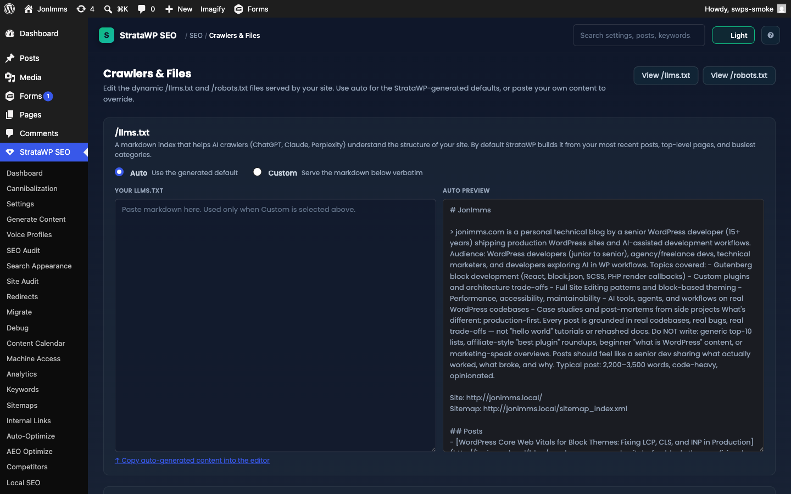

Edits the dynamic `/llms.txt` and `/robots.txt` files served by your site. Lives at `admin.php?page=swps-crawl-files`.

**How to use the /llms.txt editor:**
1. Pick a **mode**:
   - **Auto** — serve the StrataWP-generated default (built from your most recent 100 posts, top-level pages, and busiest 20 categories with one-line summaries). This is the recommended default.
   - **Custom** — serve the markdown you paste below, verbatim.
2. The page shows two textareas side-by-side: **Your llms.txt** (editable) on the left and **Auto preview** (read-only) on the right.
3. Click **↑ Copy auto-generated content into the editor** to start from the auto version, then tweak.
4. Save — visit `/llms.txt` or click **View /llms.txt** in the page header to confirm.

**How to use the /robots.txt editor:**
1. If a physical `robots.txt` exists in your site root, you'll see a warning — that file always overrides the WordPress dynamic version. Delete it to use the editor.
2. Pick a **mode**:
   - **Auto** — what WordPress would normally serve, plus the AI-bot Allow/Disallow rules StrataWP adds.
   - **Append** — Auto + your extra rules (good for adding `Disallow: /private/` or extra `Sitemap:` entries).
   - **Replace** — serve only your content (full manual control — be careful, since this skips the AI-bot rules).
3. Edit your version on the left; auto preview is on the right; "copy auto into editor" works the same way.
4. Save — visit `/robots.txt` or click **View /robots.txt** to confirm.

**Tip:** Append mode is the safest middle ground for most sites — keeps the StrataWP-managed AI bot allowlist intact while letting you add custom rules.

### Machine Access (`StrataWP SEO → Machine Access`) ★ v4.19

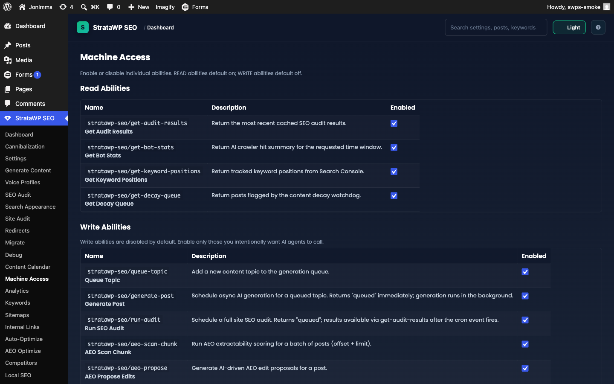

Governs what AI agents and external tools may do on your site through the plugin's 13 abilities — registered with the WP Abilities API on WordPress 6.9+ and always available over REST.

**How to use it:**
1. Each ability has its own toggle. **Read abilities** (audit results, bot stats, keyword positions, decay queue) are on by default; **write abilities** (queue topics, generate posts, run audits, AEO apply, redirects) are **off by default** — enable only what your agent needs
2. Point your agent at the REST endpoints: `GET /wp-json/swps/v1/abilities` for discovery (names, descriptions, input/output schemas, enabled state) and `POST /wp-json/swps/v1/abilities/{name}/run` to execute. Authenticate with a WordPress **application password**
3. The **activity log** on the page records every call — who, which ability, and the outcome (including denied calls), so you can audit what an agent actually did
4. Disabled or invalid calls fail cleanly with a structured error; inputs are validated against each ability's schema before anything runs

---

## Configuration Guide

All settings live under **StrataWP SEO → Settings**, split into 7 tabs: **AI & Content**, **Schedule**, **SEO**, **AI Crawlers**, **Analytics**, **AEO**, and **Advanced**. The subsections below follow the tab and section order of the actual page.

Two features keep their settings on their own pages: **Machine Access** (per-ability toggles + activity log, `StrataWP SEO → Machine Access`) and the **Site Crawler** (page caps, politeness delay, weekly re-crawl — a settings card on the Site Crawl page).

### AI Provider (AI & Content tab)

| Setting | Description |
|---|---|
| **AI Provider** | Anthropic (Claude), OpenAI (GPT), Google (Gemini), or xAI (Grok) |
| **API Key** | Per-provider; only the active provider's key is required |
| **AI Model** | Auto-updates when you switch providers |

**AI Model** — the dropdown is populated dynamically. Since v4.8.0/v4.9.0, models are auto-discovered daily from each configured provider's API (Anthropic, OpenAI, Google, xAI) and refreshed live; newly released models appear automatically with a dismissible new-model alert. Labels such as *Most powerful*, *Cheapest*, *Costs most*, and *Best value* are computed from live data, Google's list is filtered to text-generation models, and newly discovered models are priced automatically for cost tracking via family heuristics.

The plugin handles model-specific quirks automatically — for example, Claude 4.6+ models do not support assistant prefill, so the JSON-coercion prefill is disabled for those.

### Site Details (AI & Content tab)

| Setting | Description |
|---|---|
| **Site Niche** | Your industry or topic area |
| **Site Description** | Detailed description of your site, audience, and unique value proposition |

### Writing Preferences (AI & Content tab)

| Setting | Description |
|---|---|
| **Tone of Voice** | Professional, Conversational, Friendly, Authoritative, Casual, Formal, Witty |
| **Voice Profile** | Reusable persona (manage under StrataWP SEO → Voice Profiles); overrides tone/style |
| **Custom Style Notes** | Free-text instructions ("Use short paragraphs, avoid jargon") |
| **Target Keywords** | Comma-separated keywords woven into generated content + used by the keyword link engine |

### Content Settings (AI & Content tab)

| Setting | Description |
|---|---|
| **Post Status** | Draft (recommended), Pending Review, or Published |
| **Post Author** | WordPress user assigned as author |
| **Default Category** | Fixed category, or AI-decided |
| **Word Count** | Min (300-5000) and max (500-8000) targets |
| **Internal Links** | Min and max number of links to existing posts |
| **FAQ Section** | Generate FAQ with `FAQPage` schema for rich snippets |
| **Table of Contents** | Linked TOC at the top of each post |
| **Key Takeaways** | Bullet-point summary with optional `ItemList` schema |

### Featured Images (AI & Content tab)

| Setting | Description |
|---|---|
| **Auto Featured Images** | Fetch a relevant image per post |
| **Image Provider** | Unsplash, Pexels, Pixabay (free stock), or Gemini (AI-generated) |
| **In-Content Images** | Insert contextual images within the post body |
| **Images Per Post** | Number of in-content images (1-4) |
| **Image Max Width** | Maximum width in pixels (600-2400) |

### Auto-Publishing Schedule (Schedule tab)

| Setting | Description |
|---|---|
| **Enable** | Turn on scheduled generation |
| **Frequency** | Daily, twice weekly, three times weekly, weekly, biweekly, monthly |
| **Day of Week** | Starting day for the schedule |
| **Time** | Time of day to run |
| **Posts Per Run** | 1-5 posts per scheduled run |
| **Monthly AI budget (USD)** | Autopilot Guardian cap on AI spend per calendar month (0 = unlimited). A dismissible warning shows at 80%; at the cap, generation pauses until the month rolls over |

### Topic Autopilot (Schedule tab)

| Setting | Description |
|---|---|
| **Enable Topic Scout** | Weekly scan of Search Console questions, striking-distance keywords, and orphan pages that produces ranked topic proposals on the Content Calendar (on by default) |
| **Auto-promote top proposal** | Automatically queue the highest-ranked proposal each week instead of waiting for manual approval (off by default) |

### SEO Audit (SEO tab)

| Setting | Description |
|---|---|
| **Auto Canonical Tags** | Add canonical tags where missing |
| **Auto OG/Twitter Tags** | Output OG and Twitter Card meta |
| **Sitemap Generation** | Generate XML sitemap (auto-disabled if another sitemap plugin is active) |
| **Audit Schedule** | Daily, weekly, monthly |

### Schema / Structured Data (SEO tab)

| Setting | Description |
|---|---|
| **Enable Schema Markup** | Output JSON-LD (auto-disabled when Yoast/RankMath/AIOSEO active) |
| **Article Type** | Article, BlogPosting, or NewsArticle |
| **Sitelinks Searchbox** | Add `SearchAction` for Google sitelinks |
| **Site Represents** | Organization or Person |
| **Name** | Defaults to site name |
| **Logo URL** | Min 112x112px |
| **Social Profiles** | One URL per line — populates `sameAs` |

### SEO Meta Editor (SEO tab)

| Setting | Description |
|---|---|
| **Meta Editor Enabled** | Enable/disable the metabox on post edit screens |
| **Meta Editor Post Types** | Comma-separated post types (default `post,page`) |
| **Auto-Generate Meta** | Auto-generate meta title/description on publish |

### Head Cleanup (SEO tab)

| Setting | Description |
|---|---|
| **Remove WP Generator Tag** | Strip the WordPress version meta tag |
| **Remove RSD/EditURI Link** | Strip the Really Simple Discovery link |
| **Remove Windows Live Writer Link** | Strip the WLW manifest link |
| **Remove Shortlink** | Strip the `rel=shortlink` header link |
| **Remove REST API Link** | Strip the `api.w.org` discovery link |
| **Remove oEmbed Discovery** | Strip oEmbed discovery links |
| **Remove Emoji Scripts & Styles** | Drop the emoji detection script + styles |

### RSS Feed (SEO tab)

| Setting | Description |
|---|---|
| **Content Before Post in RSS** | HTML/text injected before each post in feeds |
| **Content After Post in RSS** | HTML/text injected after each post (e.g. attribution link to deter scrapers) |

### AI Crawlers (AI Crawlers tab)

| Setting | Description |
|---|---|
| **Allowed AI Bots** | Multi-checkbox of 15 known crawlers. Allowed bots get an explicit `Allow: /` rule in robots.txt; unchecked known bots get `Disallow: /` |
| **Generate llms.txt** | Serve a dynamic `llms.txt` at `/llms.txt` (overrides Yoast/other plugin output) |

### Crawler Verification (AI Crawlers tab)

| Setting | Description |
|---|---|
| **Proxy header** | How to read the client IP: None (REMOTE_ADDR), Cloudflare (CF-Connecting-IP), or X-Forwarded-For (first IP). Set only behind a trusted reverse proxy — the wrong setting allows IP spoofing |
| **Enforcement bots** | Which search bots may receive a 403 when verified-spoofed (default: none) |
| **Block Spoofed Crawlers** | Master toggle (off by default) for 403 enforcement at `template_redirect`. Fail-open: unverifiable hits always pass through, so a stale IP list can never block the real Googlebot |

### AI Citations (AI Crawlers tab)

| Setting | Description |
|---|---|
| **Check Frequency** | How often the cron runs your tracked prompts against the enabled engines |
| **Monthly Call Cap** | Hard ceiling on citation-check API calls per month (default 200) |
| **Engines** | Which of ChatGPT, Claude, Gemini, and Grok to query (bring your own key per engine; defaults to your configured text provider) |

### Analytics (Analytics tab)

| Setting | Description |
|---|---|
| **Enable On-Site Tracking** | Cookie-free pageview/engagement tracking |
| **Data Retention** | 30, 90, 180, or 365 days |
| **Exclude Admins** | Don't track logged-in admins |
| **Google OAuth Client ID/Secret** | For Search Console (secret stored encrypted) |
| **Keyword Sync Frequency** | How often tracked keyword positions sync from Google Search Console (daily / weekly / monthly; default weekly) |

### Email Digest (Analytics tab)

| Setting | Description |
|---|---|
| **Enable Digest** | Turn the white-label report email on |
| **Frequency** | Daily, weekly (default), or monthly |
| **Recipients** | One email per line (defaults to the admin email) |
| **Logo URL / Accent Color / Footer Text** | White-label branding for agency reports |
| **AI Executive Summary** | Prepend a short AI-written summary (one AI call per digest) |

A **Send test digest** link in the section header emails the current report to you immediately.

### Content Decay Watchdog (Analytics tab)

| Setting | Description |
|---|---|
| **Click decline threshold** | Percentage drop between rolling 28-day GSC windows that flags a post (default 20%) |
| **Minimum impressions (prior window)** | Ignore posts below this impression floor to avoid noise (default 200) |
| **Decay alert email** | One-email summary when top posts decay (on by default) |

### AEO Optimize (AEO tab)

| Setting | Description |
|---|---|
| **Score threshold** | 50-95 (default 70) — posts scoring below appear in the AEO Optimize queue |
| **Coverage scoring** | Enable the Coverage dimension — one AI call per scored post builds the query fan-out sub-question checklist (about $0.001-$0.003 each, cached by content hash) |
| **Dynamic schema types** | Which JSON-LD types the renderer emits: HowTo, Recipe, Product, Review, FAQPage. Defers automatically when Yoast / RankMath / AIOSEO is active |
| **Post types to score** | AEO scoring only runs on the selected post types (default `post`, `page`) |
| **Dimension weights** | Relative weights for Extractability / Markup / Authority / Coverage (defaults 0.30 / 0.30 / 0.20 / 0.20) |

### Advanced Settings (Advanced tab)

| Setting | Description |
|---|---|
| **Default Template** | Default content format |
| **Rate Limit** | Cooldown in seconds between generations |
| **Duplicate Detection** | Block posts too similar to existing content |
| **Cost Tracking** | Track tokens + estimated USD per generation |
| **Min Content Score** | Posts scoring below are forced to draft (0 disables) |
| **Remove Data on Uninstall** | Off by default: deleting the plugin keeps your settings, tables, topics, and analytics so a reinstall picks up where you left off. Enable for a full wipe on uninstall |

---

## Admin Pages

| Page | Path | Purpose |
|---|---|---|
| Dashboard | `stratawp-seo` | Landing page: health score, KPI tiles, AEO health, modules grid |
| Setup Wizard | `swps-onboarding` | Guided 5-step first-run setup |
| Settings | `swps-settings` | All plugin configuration |
| Generate Content | `swps-generate` | One-off post generation UI |
| Voice Profiles | `swps-voice-profiles` | Manage reusable personas |
| SEO Audit | `swps-seo-audit` | 10-module audit results + auto-fix |
| Site Crawl | `swps-site-crawl` | Politeness-capped self-crawl with issue queue + one-click fixes |
| Search Appearance | `swps-search-appearance` | Title/description templates |
| Redirects | `swps-redirects` | Redirect manager + 404 log |
| Migrate | `swps-migration` | Import settings + per-post meta + redirects from Yoast / Rank Math |
| Debug | `swps-debug` | Last failed AI response viewer |
| Content Calendar | `swps-calendar` | Visual content calendar + topic queue form |
| Analytics | `swps-analytics` | Unified dashboard |
| Keywords | `swps-keywords` | Keyword research + GSC tracking + AI citations card |
| Keyword Cannibalization | `swps-cannibalization` | GSC split-query findings: consolidate / differentiate / canonicalize |
| Sitemaps | `swps-sitemaps` | Sitemap status + IndexNow ping |
| Internal Links | `swps-internal-links` | Link suggestions admin |
| Auto-Optimize | `swps-auto-optimize` | Re-score + AI proposals for low-scoring posts |
| AEO Optimize | `swps-aeo-optimize` | AI-citeability scoring (4 dimensions) + AI proposals with diff review/undo |
| Refresh Queue | `swps-refresh-queue` | Decayed posts ranked by traffic at risk + reviewed AI refresh |
| Competitors | `swps-competitors` | Competitor site tracker (RSS/sitemap diff) |
| Local SEO | `swps-local-seo` | LocalBusiness JSON-LD: NAP, hours, geo, area served |
| Image SEO | `swps-image-seo` | Auto-alt, filename sanitization, lazy-load, bulk fix |
| Backlinks | `swps-backlinks` | Manual + CSV-import backlink tracker with daily verify |
| Crawlers & Files | `swps-crawl-files` | Edit `/llms.txt` and `/robots.txt` (auto/custom modes) |
| Machine Access | `swps-machine-access` | Ability toggles + activity log (WP Abilities API / REST) |

Topics are managed on the Content Calendar page, via `wp swps queue`, or the REST `/queue` endpoints — the topic post type has no admin screen of its own.

---

## WP-CLI Commands

```bash
# Generate a post
wp swps generate                                    # AI-chosen topic
wp swps generate "WordPress security best practices"
wp swps generate "How to speed up WordPress" --template=how-to

# Analyze site
wp swps analyze                  # JSON
wp swps analyze --format=table

# Plugin status (version, provider, model, schedule, costs, queue size)
wp swps status

# Manage topic queue
wp swps queue list
wp swps queue add "Topic title"
wp swps queue add "Topic" --date="2026-04-01 09:00:00" --template=listicle
wp swps queue remove 123
wp swps queue clear

# AI bot analytics (v4.5)
wp swps bot-stats                 # last 30 days, table
wp swps bot-stats --days=7
wp swps bot-stats --bot=gptbot    # filter top pages by bot key
wp swps bot-stats --format=json

# Re-run the QAPage → FAQPage schema migration (v4.9.1) —
# runs automatically once after update; use this if it was skipped
# or you restored an old database
wp swps migrate-qapage
```

Available templates: `auto`, `listicle`, `how-to`, `comparison`, `case-study`, `news`, `tutorial`

---

## REST API

All endpoints under `/wp-json/swps/v1/`:

| Method | Endpoint | Purpose |
|---|---|---|
| `POST` | `/generate` | Generate a post (topic + template) |
| `GET` | `/status` | Plugin status |
| `GET` | `/queue` | List topic queue |
| `POST` | `/queue` | Add a topic (title, date, template, notes) |
| `DELETE` | `/queue/{id}` | Remove a queued topic |
| `GET` | `/score/{id}` | Get a post's content score |
| `POST` | `/score/{id}` | Re-score a post |
| `GET` | `/voice-profiles` | List voice profiles |
| `POST` | `/voice-profiles` | Create voice profile |
| `PUT` | `/voice-profiles/{id}` | Update voice profile |
| `DELETE` | `/voice-profiles/{id}` | Delete voice profile |
| `GET` | `/audit` | Latest audit results |
| `POST` | `/audit` | Run a fresh audit |
| `POST` | `/audit/fix/{module_id}` | Auto-fix one audit module |
| `POST` | `/user-prefs/theme` | Save dark/light theme preference |
| `GET` | `/bot-analytics/summary` | AI bot hit totals (v4.5) |
| `GET` | `/bot-analytics/top-pages` | Top bot-crawled pages |
| `GET` | `/bot-analytics/gaps` | AEO gap report (posts no AI bot fetched) |
| `POST` | `/modules/{slug}/toggle` | Enable/disable a module |
| `POST` | `/aeo/scan-batch` | Score a batch of posts (v4.6) |
| `GET` | `/aeo/score/{id}` | AEO score + sub-scores for a post |
| `POST` | `/aeo/proposal/{id}` | Generate an AEO proposal |
| `POST` | `/aeo/apply/{id}` | Apply a proposal |
| `POST` | `/aeo/undo/{id}` | Undo an applied proposal |
| `POST` | `/aeo/dismiss/{id}` | Dismiss a post from the queue |
| `GET` | `/abilities` | Discover all 13 abilities: name, description, input/output schema, write flag, enabled state (v4.19) |
| `POST` | `/abilities/{name}/run` | Execute an ability — write abilities must be enabled on the Machine Access page first |

All endpoints require the `manage_options` capability except `POST /user-prefs/theme`, which only requires a logged-in user. Cookie-authenticated requests need the `X-WP-Nonce` header. For external agents, the abilities endpoints work with standard WordPress **application passwords**; every abilities call — allowed or denied — is recorded in the Machine Access activity log.

---

## Developer Reference

StrataWP SEO provides 50+ filters and actions, all using the `swps_` prefix (generation-pipeline hooks route through `SWPS_Hooks`; subsystem hooks are applied in their own classes).

### Filters

#### Content Generation

**`swps_system_prompt`** — Modify the system prompt sent to the AI.

```php
add_filter( 'swps_system_prompt', function( string $prompt, string $tone, string $style ): string {
    $prompt .= "\nAlways include a call-to-action at the end.";
    return $prompt;
}, 10, 3 );
```

**`swps_user_prompt`** — Modify the user prompt sent to the AI.

```php
add_filter( 'swps_user_prompt', function( string $prompt, string $topic, string $site_context ): string {
    return $prompt;
}, 10, 3 );
```

**`swps_ai_response`** — Modify the parsed AI response before post creation.

**`swps_post_data`** — Modify WordPress post data before insertion.

#### llms.txt

**`swps_llms_txt_content`** — Modify the full llms.txt body before output.

```php
add_filter( 'swps_llms_txt_content', function( string $content ): string {
    return $content . "\n## Custom Section\n- ...\n";
} );
```

**`swps_llms_txt_post_limit`** — Number of posts included (default 100).

#### Voice Profiles

**`swps_voice_compile`** — Modify the compiled voice-profile prompt block.

#### Images

**`swps_image_query`** — Modify the image search query.

**`swps_content_images_queries`** — Modify in-content image search queries.

**`swps_image_selection`** — Modify selected image data before insertion.

#### Schema

**`swps_schema_article`** — Modify Article JSON-LD before output. Since the unified `@graph` (v4.19), the schema filters receive a standalone-shaped copy (with `@context`); the returned data becomes the node body inside the single `@graph` block.

```php
add_filter( 'swps_schema_article', function( array $schema, int $post_id ): array {
    $schema['author']['sameAs'] = 'https://twitter.com/yourhandle';
    return $schema;
}, 10, 2 );
```

**`swps_schema_breadcrumb`** — Modify BreadcrumbList JSON-LD.

**`swps_schema_organization`** — Modify Organization/Person JSON-LD.

**`swps_faq_schema`** — Modify FAQ JSON-LD.

**`swps_takeaways_schema`** — Modify Key Takeaways ItemList JSON-LD.

#### SEO Audit

**`swps_audit_modules`** — Add or remove audit modules.

```php
add_filter( 'swps_audit_modules', function( array $modules ): array {
    $modules['my_custom_check'] = new My_Custom_Audit_Module();
    return $modules;
} );
```

**`swps_audit_result`** — Modify an individual module's audit result.

#### Analytics

**`swps_analytics_track`** — Filter tracking data before storage. Return empty array to block.

**`swps_analytics_exclude`** — Filter whether to exclude a page from tracking.

**`swps_gsc_data`** — Filter Google Search Console API response data.

#### SEO Meta Editor

**`swps_meta_title`** — Filter the meta title output for a post.

**`swps_meta_description`** — Filter the meta description output for a post.

**`swps_meta_robots`** — Filter the robots meta directives for a post.

**`swps_seo_checklist`** — Filter or add SEO checklist items in the metabox.

#### Keywords

**`swps_keyword_suggestions`** — Filter AI-generated keyword suggestions.

#### Content Scoring

**`swps_score_weights`** — Adjust content scoring weights.

#### AEO

**`swps_aeo_subscores`** — Modify the 4 dimension sub-scores before weighting.

**`swps_aeo_score`** — Modify the final weighted AEO score for a post.

**`swps_aeo_proposal`** — Modify the AI optimization proposal before it is stored.

**`swps_aeo_schema_json`** — Modify generated AEO JSON-LD before storage/output.

**`swps_authoritative_domains`** — Modify the authoritative-domain allowlist used by the Authority scorer.

#### AI Bot Analytics

**`swps_ai_bots_known`** — Add or remove known AI bots (shared by the robots.txt allowlist and bot analytics).

**`swps_bot_analytics_capture`** — Return false to veto recording a bot hit.

**`swps_bot_analytics_normalize_uri`** — Customize URI bucketing before storage.

#### Local SEO

**`swps_local_seo_emit`** — Short-circuit LocalBusiness JSON-LD output.

**`swps_local_seo_schema`** — Modify the LocalBusiness schema array before output.

#### Admin Shell

**`swps_admin_shell_nav`** — Modify the admin-shell nav/breadcrumb item map.

#### AI Referrals

**`swps_ai_referral_sources`** — Modify the referrer-host → engine map used to classify AI referral visits (add or remove AI assistant domains).

#### AI Citations

**`swps_citation_our_domains`** — Modify the list of domains counted as "your site" when parsing citation results.

**`swps_citation_prompts_cap`** — Modify the maximum number of tracked citation prompts.

#### Crawler Verification & Crawl Budget

**`swps_crawler_ip_sources`** — Modify the published IP-range source URLs fetched per search bot for CIDR verification.

**`swps_crawl_budget_sitemap_post_types`** — Modify the post types included in the crawl-budget report.

#### Site Crawler

**`swps_crawl_delay_us`** — Modify the politeness delay in microseconds between crawl requests (default 500000 = 0.5s).

#### Keyword Cannibalization

**`swps_cannibal_ctr_curve`** — Modify the expected CTR-by-position curve used to estimate cannibalization impact.

**`swps_cannibal_expected_ctr`** — Modify the computed expected CTR for a specific finding.

### Actions

**`swps_before_generate`** — Fires before content generation starts.

**`swps_after_generate`** — Fires after successful generation.

**`swps_post_created`** — Fires after the WordPress post is inserted.

```php
add_action( 'swps_post_created', function( int $post_id, array $ai_result, array $post_data ): void {
    // Add custom meta, trigger workflows
}, 10, 3 );
```

**`swps_generation_failed`** — Fires when generation fails.

**`swps_score_complete`** — Fires after content scoring completes.

**`swps_image_inserted`** — Fires after an in-content image is inserted.

**`swps_audit_complete`** — Fires after a full audit run completes.

```php
add_action( 'swps_audit_complete', function( array $results, int $overall_score ): void {
    if ( $overall_score < 50 ) {
        wp_mail( get_option( 'admin_email' ), 'SEO Score Alert', 'Score dropped to ' . $overall_score );
    }
}, 10, 2 );
```

**`swps_bot_analytics_hit`** — Fires once per captured AI-bot hit (after the row is written).

**`swps_modules_register`** — Register or modify entries in the modules registry (dashboard grid / feature toggles).

---

## Architecture

### File Map

```
stratawp-seo/
├── stratawp-seo.php              Plugin bootstrap, autoloader, main StrataWP_SEO singleton
├── uninstall.php                 Cron/cache cleanup on delete; full data wipe when opted in
├── readme.txt                    WordPress.org plugin readme
├── README.md                     This file
│
├── includes/                     Core PHP classes (one class per file, swps_ prefix)
│   ├── class-abilities-rest.php       REST discovery + execution endpoints for abilities (/swps/v1/abilities)
│   ├── class-abilities-settings.php   Machine Access admin page: per-ability toggles + activity log
│   ├── class-abilities.php            Abilities registry: validate → execute → log pipeline; WP Abilities API bridge
│   ├── class-admin-shell.php          Branded admin shell: top bar (logo, breadcrumb, search, theme toggle, help)
│   ├── class-aeo-editor-panel.php     Live AEO score panel in the post editor (classic metabox; Gutenberg sidebar via aeo-editor-panel.js)
│   ├── class-aeo-optimizer.php        AEO Optimize admin page + 6 AJAX handlers (scan/score/propose/apply/undo/dismiss)
│   ├── class-aeo-schema-generator.php AI-driven dynamic JSON-LD for HowTo, Recipe, Product, Review, FAQPage
│   ├── class-aeo-schema-migrator.php  Converts legacy QAPage JSON-LD post meta to FAQPage (issue #44)
│   ├── class-aeo-scorer.php           AEO orchestrator: weights 4 sub-scorers into one score, persists to post meta
│   ├── class-ai-bots.php              robots.txt allowlist + dynamic llms.txt
│   ├── class-ai-provider.php          Abstract base + JSON parser with 5-stage repair; search-grounded citation methods
│   ├── class-ai-referrals-report.php  AI Referrals analytics queries (engine trends, landing posts, engagement)
│   ├── class-ai-referrals.php         Classifies human visits from AI assistants (ChatGPT, Perplexity, Claude, …)
│   ├── class-analytics-dashboard.php  Admin dashboard rendering + Chart.js data
│   ├── class-analytics-tracker.php    Cookie-free pageview/engagement tracker
│   ├── class-analyzer.php             Site analysis: posts, categories, link graph
│   ├── class-api.php                  Internal API helpers
│   ├── class-audit-module.php         Abstract base for audit modules
│   ├── class-author-profile.php       Author E-E-A-T profile fields (job title, credentials, sameAs) on user profiles
│   ├── class-auto-optimize.php        Scans underperforming posts, proposes AI edits, applies on approval
│   ├── class-autopilot-guardian.php   Monthly AI budget cap, transient-error retry/backoff, topic requeue
│   ├── class-background-processor.php Queue + cron for long-running tasks
│   ├── class-backlinks.php            Manual + CSV-import backlink tracker with daily live/lost/broken verification
│   ├── class-bot-analytics-tracker.php Server-side AI crawler hit tracking (raw + daily rollup tables)
│   ├── class-breadcrumbs.php          Frontend breadcrumb output + schema
│   ├── class-cache-manager.php        Transient + object-cache abstraction
│   ├── class-calendar.php             Visual calendar for topic queue + proposed-topic approve/dismiss
│   ├── class-cannibalization-admin.php Cannibalization page: consolidate (undoable 301) / differentiate / canonicalize
│   ├── class-cannibalization.php      GSC split-impression detection core + weekly scan
│   ├── class-citation-admin.php       Citations card on Keywords + settings section (frequency, cap, engines)
│   ├── class-citation-prompts.php     Tracked prompt list, seed candidates, enabled engines, our-domains config
│   ├── class-citation-store.php       Citation results storage + share-of-voice / cited-domains queries
│   ├── class-citation-tracker.php     Search-grounded citation checks across engines with monthly call caps
│   ├── class-cli.php                  WP-CLI command registration
│   ├── class-competitors.php          Competitor watch: daily RSS/sitemap scans, homepage title/H1/schema diffs
│   ├── class-content-scorer.php       Quality scoring for generated content
│   ├── class-cost-tracker.php         Per-provider/model token + USD tracking
│   ├── class-crawl-budget-report.php  Crawl-budget-by-post-type queries + daily reconciliation
│   ├── class-crawl-files.php          Crawlers & Files page: edit /llms.txt (auto/custom) and /robots.txt (auto/append/replace)
│   ├── class-crawl-issues.php         Site-crawl issue storage (status, resolution, ignore lists)
│   ├── class-crawler-enforcement.php  Opt-in fail-open 403 for verified-spoofed crawlers (template_redirect)
│   ├── class-crawler-verification.php CIDR + rDNS search-bot verification; cron-refreshed published IP ranges
│   ├── class-cron.php                 Scheduled auto-publish runner
│   ├── class-dashboard.php            Dashboard landing page: KPI tiles, recent activity, modules grid
│   ├── class-decay-watchdog.php       Weekly 28-day-window GSC decay scan with cause heuristics + email alert
│   ├── class-digest-settings.php      Email digest settings section + test-send
│   ├── class-digest.php               White-label digest: failure tracking, data assembly, send pipeline
│   ├── class-duplicate-checker.php    Title/content similarity detection
│   ├── class-encryption.php           AES-256-GCM secret storage (transparent legacy-CBC upgrade)
│   ├── class-generator.php            The main AI content generation pipeline
│   ├── class-github-updater.php       One-click plugin updates from GitHub Releases (stratawp-seo.zip asset)
│   ├── class-head-cleanup.php         wp_head tag removal (generator, RSD, oEmbed, etc.)
│   ├── class-hooks.php                Generation-pipeline filter/action hub (swps_* prefix)
│   ├── class-image-inserter.php       In-content image placement engine
│   ├── class-image-provider.php       Abstract base for image providers
│   ├── class-image-seo.php            Auto-alt (heuristic/AI), filename sanitization, lazy-loading, bulk media fix
│   ├── class-images.php               Image utility helpers
│   ├── class-internal-links-admin.php Admin UI for link suggestions
│   ├── class-internal-links.php       Internal linking orchestrator
│   ├── class-keyword-tracker.php      GSC sync + striking distance detection
│   ├── class-keywords-page.php        Keyword research admin page
│   ├── class-link-ai-engine.php       AI-powered internal link suggestions
│   ├── class-link-keyword-engine.php  Keyword-anchor link suggestions
│   ├── class-local-seo.php            LocalBusiness JSON-LD: NAP, opening hours, geo, area served
│   ├── class-meta-editor.php          Per-post SEO metabox + frontend output
│   ├── class-metric-history.php       Per-post clicks/impressions/AEO-score history store (sparkline data)
│   ├── class-migration.php            Import settings + post meta + redirects from Yoast / Rank Math
│   ├── class-model-catalog.php        Pure-PHP model heuristics: provider, power rank, default pricing, superlative labels
│   ├── class-model-cron.php           Daily swps_refresh_models cron that refreshes discovered models
│   ├── class-model-discovery.php      Merges curated model lists with live provider-API discovery; never auto-switches
│   ├── class-modules.php              Modules registry: feature toggles + dashboard-grid source of truth
│   ├── class-onboarding.php           Setup Wizard (5 steps) + dashboard setup checklist
│   ├── class-post-list-seo.php        Posts list table SEO column + bulk edits
│   ├── class-provider-factory.php     Resolves the active AI/image provider class
│   ├── class-question-coverage.php    GSC question mining: unanswered searcher questions per post
│   ├── class-rate-limiter.php         Cooldown between generations
│   ├── class-redirect-admin.php       Redirect manager admin UI
│   ├── class-redirect-manager.php     Redirect matching, 404 logging, slug-change auto-redirect
│   ├── class-refresh-queue-admin.php  Refresh Queue page: decayed posts, sparklines, reviewed AI refresh
│   ├── class-rest-api.php             REST endpoints (/wp-json/swps/v1/...)
│   ├── class-rss-optimizer.php        RSS feed before/after content injection
│   ├── class-schema-graph.php         Unified @graph builder: accumulates nodes, emits one interlinked JSON-LD block
│   ├── class-schema-validator.php     JSON-LD extraction + field-presence / orphan-ref / date-consistency checks
│   ├── class-schema.php               JSON-LD node builders (Article, Breadcrumb, WebSite, Org/Person, FAQ, ItemList)
│   ├── class-search-appearance.php    Title/description template engine
│   ├── class-search-console.php       GSC OAuth + API client
│   ├── class-seo-audit.php            Audit orchestrator + dashboard widget
│   ├── class-settings.php             All settings registration + admin pages
│   ├── class-site-crawl-admin.php     Site Crawl page: chunked crawl runner + one-click fixes
│   ├── class-site-crawler.php         Politeness-capped crawler: parsing, link extraction, 8 issue detectors
│   ├── class-sitemap-admin.php        Sitemap admin page + IndexNow ping AJAX
│   ├── class-sitemap-manager.php      Sitemap generation + IndexNow batch submission
│   ├── class-taxonomy-meta.php        Per-term archive meta
│   ├── class-templates.php            Content template definitions (listicle, how-to, etc.)
│   ├── class-topic-queue.php          Topic queue custom post type + helpers
│   ├── class-topic-scout-cron.php     Weekly scout cron + Topic Autopilot settings (enable, auto-promote)
│   ├── class-topic-scout.php          Signal ranking (GSC questions, striking distance, orphans) → proposals
│   ├── class-user-prefs.php           Per-user preferences storage (admin theme, UI state)
│   ├── class-visibility-funnel.php    AEO × crawl × visit joins; funnel stage rates for dashboard/queue
│   ├── class-voice-profile.php        Voice profile CPT + system prompt injection
│   ├── trait-ability-defs.php         Definitions of the 13 abilities (schemas, write flags, callbacks)
│   ├── trait-digest-send.php          Digest email template rendering + send
│   │
│   ├── aeo/                      4 AEO sub-scorers
│   │   ├── class-authority-scorer.php      Byline, freshness, authoritative outbound links
│   │   ├── class-coverage-scorer.php       LLM-judged topic completeness + entity clarity
│   │   ├── class-extractability-scorer.php Self-contained paragraphs, declarative ratio, structure
│   │   └── class-markup-scorer.php         Q&A pairing + schema-type alignment (infer_schema_type())
│   │
│   ├── audit/                    10 audit modules (extend SWPS_Audit_Module)
│   │   ├── class-canonical-module.php
│   │   ├── class-image-seo-module.php
│   │   ├── class-meta-robots-module.php
│   │   ├── class-opengraph-module.php
│   │   ├── class-pagespeed-module.php
│   │   ├── class-robots-module.php
│   │   ├── class-schema-audit-module.php
│   │   ├── class-site-crawl-module.php
│   │   ├── class-sitemap-module.php
│   │   └── class-twitter-module.php
│   │
│   ├── data/                     JSON manifests
│   │   ├── aeo-schema-fields.json          Required/recommended fields per schema type
│   │   └── authoritative-domains.json      Allowlist for the Authority scorer
│   │
│   └── providers/                AI + image provider implementations
│       ├── ai/
│       │   ├── class-anthropic-provider.php
│       │   ├── class-google-provider.php
│       │   ├── class-openai-provider.php
│       │   └── class-xai-provider.php
│       └── images/
│           ├── class-gemini-provider.php
│           ├── class-pexels-provider.php
│           ├── class-pixabay-provider.php
│           └── class-unsplash-provider.php
│
├── templates/                    Admin page view files (PHP templates)
│   ├── aeo-page.php
│   ├── analytics-page.php
│   ├── audit-page.php
│   ├── auto-optimize-page.php
│   ├── backlinks-page.php
│   ├── calendar-page.php
│   ├── competitors-page.php
│   ├── cannibalization-finding.php
│   ├── crawl-files-page.php
│   ├── dashboard-page.php
│   ├── email/                    Digest email template
│   ├── generate-page.php
│   ├── image-seo-page.php
│   ├── internal-links-page.php
│   ├── keywords-page.php
│   ├── local-seo-page.php
│   ├── meta-editor-metabox.php
│   ├── migration-page.php
│   ├── onboarding-page.php
│   ├── redirects-page.php
│   ├── refresh-queue-page.php
│   ├── search-appearance-page.php
│   ├── settings-page.php
│   ├── site-crawl-page.php
│   ├── sitemaps-page.php
│   ├── voice-profile-edit.php
│   ├── voice-profiles-page.php
│   └── partials/
│       └── page-header.php       Shared page header (also used by the inline Debug page)
│
├── admin/
│   ├── css/                      Design system (tokens.css, components.css, shell.css, templates.css) + per-page CSS (admin.css, aeo.css, calendar.css, pages/*.css)
│   └── js/                       Per-page JS (admin.js + shell.js shared; aeo-optimizer.js, dashboard.js, backlinks.js, etc.)
│
├── docs/                         Internal docs and notes
└── screenshots/                  WP plugin screenshots
```

### Boot Sequence

1. **`stratawp-seo.php`** loads — `require_once` chains pull in every `includes/` class (deliberate dependency order: base classes → providers → factory → consumers).
2. **`StrataWP_SEO::instance()`** — singleton runs `__construct()` which:
   - Initializes foundation subsystems (cache, duplicate checker, rate limiter, cost tracker, voice profiles, content scorer, AEO scorers, model catalog)
   - Resolves the active AI and image providers via `SWPS_Provider_Factory`
   - Instantiates ~50 service classes and stores them as public properties (e.g., `$this->generator`, `$this->settings`, `$this->aeo_optimizer`)
   - Hooks into `init`, `admin_menu`, `admin_init`, `wp_enqueue_scripts`, `admin_enqueue_scripts`, `wp_ajax_*`, `rest_api_init`, etc.
3. **CLI commands** registered if `WP_CLI` is defined.
4. **First request** — providers stay lazy (only instantiated when `chat()` / `chat_json()` is called).

### Provider Pattern

Both AI and image subsystems use the same pattern:

```
SWPS_AI_Provider (abstract)
    ├── SWPS_Anthropic_Provider
    ├── SWPS_OpenAI_Provider
    ├── SWPS_Google_Provider
    └── SWPS_XAI_Provider

SWPS_Image_Provider (abstract)
    ├── SWPS_Unsplash_Provider
    ├── SWPS_Pexels_Provider
    ├── SWPS_Pixabay_Provider
    └── SWPS_Gemini_Provider
```

`SWPS_Provider_Factory::create_ai_provider()` reads the `swps_ai_provider` option and returns the right concrete class. Each provider:

- Defines `get_slug()`, `get_name()`, `get_api_key_url()`, `get_available_models()`
- Implements `chat()` (raw text) and inherits `chat_json()` (5-stage JSON parser with quote repair, control-char sanitization, BOM/fence stripping, Unicode separator removal, brace trimming)
- Reports `last_usage` (input/output tokens) and `last_stop_reason` for cost tracking and truncation detection
- Model lists are no longer static: `SWPS_Model_Discovery` merges each provider's curated list with models discovered daily from the provider's API (`SWPS_Model_Cron` schedules the `swps_refresh_models` event), and `SWPS_AI_Provider` validates the selected model through `SWPS_Model_Discovery::validate_selection()` at generation time. `SWPS_Model_Catalog` (pure PHP) supplies power ranking, default pricing, and the dynamic superlative labels (Most powerful, Cheapest, Costs most, Best value)

### The Hooks Hub

`SWPS_Hooks` (in `class-hooks.php`) is the central entry point for the content-generation `swps_*` hooks (system/user prompt, AI response, post data, images, scoring). The generation pipeline calls `SWPS_Hooks::filter_system_prompt()`, `filter_user_prompt()`, `filter_ai_response()`, `filter_post_data()`, etc. — and any plugin or theme can hook in. Newer subsystems (AEO, Bot Analytics, Local SEO, llms.txt) apply their `swps_*` filters directly in their own classes — see the [Developer Reference](#developer-reference) for the full list.

---

## How Each Subsystem Works

### Content Generation Pipeline

`SWPS_Generator::generate( $topic, $template )` walks through:

1. **Rate limit** — block if cooldown active (`SWPS_Rate_Limiter`)
2. **Duplicate check** — refuse if a published post is too similar (`SWPS_Duplicate_Checker`)
3. **Site analysis** — fetch existing posts, categories, internal link candidates (`SWPS_Analyzer`)
4. **Prompt build** — system prompt (with voice profile injection) + user prompt with site context, template instructions, target keywords, internal link list
5. **AI call** — `SWPS_AI_Provider::chat_json()` with 16,384 max tokens and a strict JSON schema requirement
6. **JSON parse** — 5-stage repair pipeline (see `parse_json_response()` in `class-ai-provider.php`). Failures save the raw response to a transient and surface a Debug admin page.
7. **Image fetch** — featured image from configured provider; in-content images placed by `SWPS_Image_Inserter`
8. **Post insert** — `wp_insert_post()` with full schema metadata
9. **Content scoring** — `SWPS_Content_Scorer` rates the result; below `min_content_score` → forced to draft
10. **Hooks fire** — `swps_post_created`, `swps_after_generate`

### AI Crawler Allowlist (`SWPS_AI_Bots`)

- Hooks `robots_txt` filter at priority 100, appends a `# AI crawlers — managed by StrataWP SEO` block with `Allow: /` per allowed bot and `Disallow: /` for known bots the user has unchecked.
- Default behavior (no option saved): all 15 known bots are allowed.
- Option name: `swps_ai_bots_allowed` (array of bot keys from `SWPS_AI_Bots::KNOWN_BOTS`).

### llms.txt Generator (`SWPS_AI_Bots::maybe_serve_llms_txt`)

- Hooks `init` at priority 1 (before Yoast or any other plugin can serve `/llms.txt`).
- Returns `text/markdown` content with `X-Robots-Tag: noindex`.
- Body composition:
  - `# {site_name}` + `> {site_description}` (uses your plugin's Site Description field, falls back to WP tagline)
  - `Site:` and `Sitemap:` lines — the sitemap URL comes from `SWPS_Sitemap_Manager::get_sitemap_url()`, the same single source of truth used by robots.txt (defers to Yoast/Rank Math/AIOSEO sitemap locations when one of those plugins handles sitemaps)
  - `## Posts` — 100 most recent published posts
  - `## Pages` — top-level published pages (excluding home)
  - `## Categories` — 20 most-used categories
- Per-entry summary uses (in order): plugin meta description → Yoast meta → RankMath meta → post excerpt → trimmed first paragraph (~200 chars at sentence boundary).
- Filterable via `swps_llms_txt_content` and `swps_llms_txt_post_limit`.

### Sitemap Manager (`SWPS_Sitemap_Manager`)

- Generates `/sitemap_index.xml` and per-type sub-sitemaps (`{post_type}-sitemap.xml`, `{taxonomy}-sitemap.xml`, `author-sitemap.xml`).
- Each sub-sitemap respects the `swps_sitemap_exclude_{key}` option.
- `urls_per_page` setting controls split point (default 1000, max 50000).
- Image sitemap entries built from post attachments.
- **IndexNow batch submit** — `ping_search_engines()` posts up to 50 most recently modified posts to `api.indexnow.org`, returns `{submitted, status, error}` for the admin UI to display.
- Auto-fires after publish/update via `transition_post_status` (when enabled in audit settings).

### SEO Audit (`SWPS_SEO_Audit`)

- Loads 10 modules, each extending `SWPS_Audit_Module`:
  - `Canonical_Module` — checks `<link rel="canonical">` on key URLs
  - `Sitemap_Module` — verifies sitemap accessibility and indexability
  - `OpenGraph_Module` / `Twitter_Module` — social meta presence
  - `Robots_Module` — robots.txt sanity (disallow rules, sitemap reference)
  - `Meta_Robots_Module` — per-page robots meta
  - `Image_SEO_Module` — alt text, image dimensions
  - `Pagespeed_Module` — basic page speed hints (render-blocking, image weight)
  - `Schema_Audit_Module` — validates JSON-LD on sampled live pages (required fields, orphan refs, date consistency) — read-only
  - `Site_Crawl_Module` — read-only view of the latest stored site-crawl run
- Each module returns `{score, status, message, issues[], fixable}`.
- Auto-fix runs registered fixers when `audit_auto_*` options are on.
- Dashboard widget shows aggregate score; full report has CSV export.
- Filterable: `swps_audit_modules`, `swps_audit_result`; the `swps_audit_complete` action fires after each full run.

### Schema Output (`SWPS_Schema`)

- Hooks `wp_head` and outputs JSON-LD blocks for:
  - **Article / BlogPosting / NewsArticle** on posts
  - **BreadcrumbList** on all post types and taxonomies
  - **WebSite** (with `SearchAction` if enabled) on the homepage
  - **Organization** or **Person** site representation with logo + `sameAs` socials
- Auto-disables completely if `WPSEO_VERSION`, `RankMath`, or `AIOSEO_VERSION` is defined.
- Each block runs through a `swps_schema_{type}` filter for customization.

### AEO Optimize (`SWPS_AEO_Scorer` → `SWPS_AEO_Optimizer`)

- Scores posts on 4 AI-citeability dimensions, each a class in `includes/aeo/` (default weights, re-normalized if Coverage is skipped):
  - **Extractability** (0.30) — self-contained paragraphs, declarative ratio, structural density, definitional lead
  - **Markup** (0.30) — explicit question/answer pairing + correct schema type for the content (`infer_schema_type()`)
  - **Authority** (0.20) — byline, freshness, authoritative outbound links (allowlist in `includes/data/authoritative-domains.json`), current-year mentions
  - **Coverage** (0.20) — LLM-judged topic completeness and entity clarity (1 AI call per scored post)
- `SWPS_AEO_Optimizer` mirrors the Auto-Optimize pattern: chunked scan (10 posts/request), per-post propose → diff review → apply (with undo snapshot) → re-score, plus dismiss. Queue persists in post meta across navigation.
- `SWPS_AEO_Schema_Generator` builds dynamic JSON-LD for HowTo, Recipe, Product, Review, and FAQPage from the field manifest in `includes/data/aeo-schema-fields.json`, validates required fields before emitting, and defers to Yoast/RankMath/AIOSEO. `SWPS_AEO_Schema_Migrator` rewrites legacy QAPage meta to FAQPage (`wp swps migrate-qapage`).
- `SWPS_AEO_Editor_Panel` surfaces the live score in the post editor (Gutenberg sidebar + classic metabox).
- Filterable: `swps_aeo_subscores`, `swps_aeo_score`, `swps_aeo_proposal`, `swps_aeo_schema_json`, `swps_authoritative_domains`.

### Meta Editor (`SWPS_Meta_Editor`)

- Adds a metabox to the post editor for selected post types (default `post`, `page`).
- Stores per-post: `_swps_meta_title`, `_swps_meta_description`, `_swps_focus_keyword`, `_swps_canonical_url`, `_swps_robots_noindex`, `_swps_robots_nofollow`, `_swps_og_*`, `_swps_twitter_*`, `_swps_breadcrumb_title`.
- Renders live SERP preview, character counters, SEO checklist (focus keyword presence in title/H1/first paragraph/URL/meta).
- AI Generate button (admin AJAX) calls the active AI provider and fills meta title + description.
- Frontend output via `wp_head` — disabled if Yoast/RankMath/AIOSEO is active.

### On-Site Analytics (`SWPS_Analytics_Tracker`)

- Cookie-free. Tracks: post URL, referrer, time on page (sendBeacon on unload), scroll depth (max %), bounce status (left in <10s without interaction).
- Tracking script enqueued only on singular posts when enabled.
- Server-side filter `swps_analytics_exclude` and data filter `swps_analytics_track` for control.
- Stored in custom table `wp_swps_analytics`. Cron-pruned to retention setting.

### AI Bot Analytics (`SWPS_Bot_Analytics_Tracker`)

- Captures hits from the 15 known AI crawlers (shared `SWPS_AI_Bots::KNOWN_BOTS` list) on `shutdown` at priority 999, so the post ID, `is_404()` state, and response code are settled. Server-side only — no JS, no IP or referrer storage.
- Raw rows live in `wp_swps_bot_hits` for 7 days; a daily cron rolls older rows into `wp_swps_bot_hits_daily` and prunes per `swps_bot_analytics_retention` (default 90 days).
- Skips admin/AJAX/cron/REST/WP-CLI requests and configurable path prefixes; optional 0–100% sample rate for high-traffic sites.
- Feeds the "AI Crawlers" section of the Analytics page (totals with delta, per-bot breakdown, top crawled pages, AEO gap report, recent bot 404s), `GET /swps/v1/bot-analytics/{summary,top-pages,gaps}`, the per-post analytics metabox, and `wp swps bot-stats`.
- Extensible: `swps_ai_bots_known`, `swps_bot_analytics_capture`, `swps_bot_analytics_normalize_uri` filters; `swps_bot_analytics_hit` action.

### Search Console (`SWPS_Search_Console`)

- OAuth flow stores token in `swps_gsc_token` (refresh token encrypted via `SWPS_Encryption`).
- API client wraps GSC `searchAnalytics.query` for clicks/impressions/CTR/position.
- Used by `SWPS_Keyword_Tracker` (rank tracking) and the analytics dashboard (top queries).

### Backlinks (`SWPS_Backlinks`)

- Tracks user-supplied backlinks (manual entry or CSV import — auto-detects Google Search Console "Top linking sites" exports) in `wp_swps_backlinks`.
- Daily WP-cron re-fetches each source page, looks for any link whose href contains your host, captures anchor text, and sets status: **live** (link found), **lost** (page loads but link gone), **broken** (4xx/5xx or timeout).
- AJAX bulk-verify in 25-row batches, per-row re-verify and delete, CSV export, dashboard tile + recent-activity list. No external paid index — it monitors the list you give it.

### Competitor Watch (`SWPS_Competitors`)

- Tracks up to 10 competitor URLs; daily WP-cron scan plus per-row "Scan now" and "Scan all".
- Data sources in order: RSS/Atom feed (auto-discovered or common-path fallback) → sitemap.xml fallback; always also fetches the homepage for `<title>`, first `<h1>`, and JSON-LD schema types.
- Keeps the last 12 snapshots per competitor and diffs the latest two — surfacing new posts, new schema types, and title/H1 changes on the Competitors page and the dashboard "Competitor watch" widget.

### Voice Profiles (`SWPS_Voice_Profile`)

- Custom post type `swps_voice_profile`.
- Fields: name, tone, formality (1-10), sentence length, vocabulary level, person (first/second/third), avoid_phrases (array), preferred_phrases (array), example_content (≤500 chars sample).
- When active (selected in settings), `inject_voice_profile()` filter prepends a compiled `VOICE PROFILE` block to the system prompt at priority 5 (before other system-prompt filters).

### Internal Links (`SWPS_Internal_Links`)

- Two engines:
  - **Keyword engine** — looks for `target_keywords` settings + post titles in content of other published posts; suggests anchor text.
  - **AI engine** — sends a small batch of post excerpts to the AI for semantic link suggestions.
- Background processor runs in chunks to avoid timeouts.
- Admin UI lets you accept/skip per suggestion.

### Redirect Manager (`SWPS_Redirect_Manager`)

- Stored in custom table with columns: `source`, `target`, `status_code`, `is_regex`, `hits`, `last_hit`.
- Matched on `template_redirect` action (early enough to short-circuit before the page renders).
- 404 logging table feeds the "Create redirect" one-click button on the redirects admin.
- Slug-change hook (`post_updated`) auto-creates 301 from old to new slug when enabled.

### Cron / Auto-Publishing (`SWPS_Cron`)

- Custom WP-Cron schedules registered for biweekly and three-times-weekly cadences.
- `swps_auto_generate` hook fires `SWPS_Generator::generate()` with the next queued topic (or AI-chosen if queue empty).
- Schedule UI shows next run time computed from frequency + day-of-week + time settings.

### Cost Tracking (`SWPS_Cost_Tracker`)

- Pricing is resolved per model via `SWPS_Model_Catalog::price_for()` — known models use the curated price table, and newly discovered models are priced by family heuristics so new IDs never fall through to a $0 default (v4.9.0).
- Records every generation: provider, model, input tokens, output tokens, computed cost.
- Aggregated for the admin dashboard.

### Model Discovery (`SWPS_Model_Discovery` / `SWPS_Model_Cron` / `SWPS_Model_Catalog`)

- `SWPS_Model_Cron` schedules the daily `swps_refresh_models` WP-Cron event; `SWPS_Model_Discovery` fetches each configured provider's model-list API and merges the results with the curated fallback lists. New models appear in the Settings dropdown automatically with a dismissible alert — nothing ever auto-switches the selected model.
- `validate_selection()` keeps a discovered model valid at generation time (pre-4.9.0 an unknown ID silently fell back to the default).
- `SWPS_Model_Catalog` (pure PHP, unit-testable) derives provider, power rank, and default pricing from a model ID, and computes the dynamic superlative labels (Most powerful, Cheapest, Costs most, Best value) across the current lineup. Google's list is filtered to text-generation models only.

### Encryption (`SWPS_Encryption`)

- AES-256-GCM (authenticated — tampering is detected) via `openssl_*`, key derived from `wp_salt( 'auth' )`. Legacy AES-256-CBC values written before 4.5.1 decrypt transparently and are upgraded to GCM the next time the owning setting is saved.
- `decrypt()` fails safe — returns `''` instead of forwarding a corrupt blob to AI/GSC APIs; `encrypt()` never falls back to storing plaintext.
- Used for `swps_jon_ai_secret`, `swps_gsc_client_secret`, and the GSC access/refresh tokens. Values are prefixed `encrypted:v2:` (GCM) / `encrypted:` (legacy) so `is_encrypted()` can detect them.

### Autopilot Guardian (`SWPS_Autopilot_Guardian`)

- Before any generation, `check_budget()` compares month-to-date AI spend (from `SWPS_Cost_Tracker`) against `swps_monthly_budget`; at 80% an admin notice appears, at 100% generation pauses until the month rolls over.
- API errors are classified transient (429/5xx/timeouts) vs permanent; transient errors retry with exponential backoff, and a failed topic is requeued up to 3 times instead of aborting the batch.

### Email Digest (`SWPS_Digest` / `SWPS_Digest_Settings`)

- Cron assembles generations, recorded failures, keyword movers, backlink/competitor changes, AI-bot trends, and AI spend for the window (1/7/30 days), leads with a needs-attention triage section, optionally prepends an AI executive summary, and sends a branded HTML email to all recipients. The AEO snapshot is only persisted after a successful send.

### Content Decay Watchdog (`SWPS_Decay_Watchdog` / `SWPS_Metric_History` / `SWPS_Refresh_Queue_Admin`)

- Weekly cron pulls per-post GSC metrics for two adjacent rolling 28-day windows, flags posts whose clicks dropped past `swps_decay_threshold` (with a minimum-impressions floor and per-post cooldowns), classifies a heuristic cause, snapshots metric + AEO-score history for sparklines, and optionally emails a summary. Refresh proposals reuse the AEO propose/apply/undo pipeline.

### AI Referrals & Visibility Funnel (`SWPS_AI_Referrals` / `SWPS_Visibility_Funnel`)

- The analytics tracker classifies each pageview's referrer host against an AI-assistant map (`swps_ai_referral_sources` filter) at capture; daily rollups feed the AI Referrals section. `SWPS_Visibility_Funnel` joins AEO scores × bot-crawl recency × AI visits per post to power the gap-report score sort, the AEO queue columns, the editor-panel funnel line, and the dashboard funnel tile.

### AI Citation Tracker (`SWPS_Citation_Tracker` / `SWPS_Citation_Prompts` / `SWPS_Citation_Store`)

- Runs tracked prompts through each enabled engine's search-grounded API (BYO keys), parses cited URLs, records whether any of "our domains" (`swps_citation_our_domains`) appear, and derives per-engine state (cited/lost/never/mixed), share of voice, and a cited-domains breakdown. A monthly call cap (default 200) bounds spend; lost citations feed context into AEO proposals.

### Question Coverage (`SWPS_Question_Coverage` + the Coverage scorer)

- The AEO Coverage dimension asks the AI for the fan-out sub-questions an answer engine would decompose the topic into and marks each answered / partial / missing (cached by content hash). Separately, a weekly GSC mining cron finds real question queries a post gets impressions for but doesn't answer (fuzzy heading match), surfaces them in the editor panel, feeds Q&A inserts into proposals, and queues uncovered questions as topic suggestions.

### Crawler Verification & Enforcement (`SWPS_Crawler_Verification` / `SWPS_Crawler_Enforcement` / `SWPS_Crawl_Budget_Report`)

- Search bots (`SWPS_AI_Bots::SEARCH_BOTS` — analytics-only, never in robots.txt/llms.txt) are tracked like AI bots; each hit's IP is checked against cron-fetched published CIDR ranges with an rDNS fallback → verified / spoofed / unverifiable. Daily reconciliation produces smoothed admin notices; the opt-in enforcement layer 403s only *verified-spoofed* hits (fail-open). Raw IPs live 7 days, then only IP-free daily aggregates remain.

### Site Crawler (`SWPS_Site_Crawler` / `SWPS_Crawl_Issues` / `SWPS_Site_Crawl_Admin`)

- BFS crawl of your own site with page caps and a politeness delay (`swps_crawl_delay_us`), run in admin AJAX chunks or a weekly background re-crawl. Pure parsing detects 8 issue types; fixes route through existing subsystems (Redirect Manager, sitemap exclusion meta). The latest run summary feeds a read-only audit module.

### Keyword Cannibalization (`SWPS_Cannibalization` / `SWPS_Cannibalization_Admin`)

- Weekly GSC scan groups queries served by multiple posts, picks the winner by aggregate performance, and estimates impact via an expected CTR-by-position curve (`swps_cannibal_ctr_curve`). Resolutions: consolidate (301 through `SWPS_Redirect_Manager`, undoable), differentiate, canonicalize, or dismiss.

### Schema @graph (`SWPS_Schema_Graph` / `SWPS_Author_Profile` / `SWPS_Schema_Validator`)

- `SWPS_Schema` builds nodes; `SWPS_Schema_Graph` interlinks them by stable `@id` and emits one `@graph` block per page. Author profile fields become Person entities (+ ProfilePage on author archives). `SWPS_Schema_Validator` powers the schema audit module: samples live URLs, extracts JSON-LD, checks required fields, orphan refs, and date consistency.

### Topic Scout (`SWPS_Topic_Scout` / `SWPS_Topic_Scout_Cron`)

- Weekly cron ranks signals (unanswered GSC questions, striking-distance keywords, orphan pages) into normalized topic proposals saved as `proposed`-status queue entries with a rationale. Calendar UI approves (→ queued) or dismisses; auto-promote queues the top proposal automatically.

### Abilities (`SWPS_Abilities` / `SWPS_Abilities_REST` / `SWPS_Abilities_Settings`)

- 13 abilities defined in `trait-ability-defs.php` with input/output schemas and write flags. Execution pipeline: enabled-check → schema validation → callback → activity log. Registered with the WP Abilities API on `wp_abilities_api_init` (WP 6.9+) and always exposed via `GET /abilities` + `POST /abilities/{name}/run`. Reads default on, writes default off.

### Onboarding (`SWPS_Onboarding`)

- Five canonical steps (`migrate`, `api_key`, `site_info`, `audit`, `preview`) tracked in an option; first-activation redirect into the wizard, AJAX backends per step, and a dashboard checklist until complete or dismissed.

---

## Privacy & Data

StrataWP SEO is built first-party and cookie-free:

- **On-site analytics** stores no cookies, no IP addresses, and no personal data, and calls no external services — no consent banner needed. AI referral classification uses only the HTTP referrer header at capture time.
- **Bot analytics** is server-side (no JS) and applies to known crawler user-agents only. For crawler spoof verification, the client IP of a *known search-bot user-agent* is kept in the raw hits table for up to **7 days** (that's what CIDR/rDNS verification needs), after which rows are rolled into daily aggregate tables that contain **no IP addresses**. Human visitors' IPs are never stored.
- **AI providers** only receive data when you use an AI feature (generation, proposals, coverage scoring, citation checks) — bring-your-own-key, billed by your provider.
- **Secrets** (API keys, GSC OAuth tokens) are encrypted at rest with authenticated AES-256-GCM.
- **Uninstall** keeps your data by default; enable **Remove Data on Uninstall** (Settings → Advanced) for a full wipe.

---

## Frequently Asked Questions

### What happens to my data if I delete the plugin?

By default, nothing is lost: uninstalling only clears scheduled tasks and caches, so your settings, custom tables (analytics, keywords, redirects, links, backlinks), topics, and voice profiles all survive a delete + reinstall. If you want a true clean removal, enable **Remove Data on Uninstall** under Settings → Advanced before deleting — then everything the plugin ever stored is permanently wiped.

### Which AI provider should I use?

Anthropic (Claude) is recommended for the best content quality, but OpenAI, Google, and xAI are excellent alternatives. Since v4.9.0 the model dropdown is fetched live from each provider's API and refreshed daily, with dynamically computed labels (Most powerful, Cheapest, Costs most, Best value) — pick "Best value" for everyday generation and "Most powerful" for cornerstone content.

### Will this plugin conflict with Yoast SEO or RankMath?

No. Schema and meta-tag output **automatically disable** themselves when Yoast, RankMath, or AIOSEO is detected. Sitemaps, content generation, audit, redirects, breadcrumbs, analytics, and AI Crawlers/llms.txt features all work alongside any SEO plugin.

### Can I migrate from Yoast SEO or Rank Math?

Yes — **StrataWP SEO → Migrate** (added v4.4.0). Imports per-post SEO meta (title, description, focus keyword, canonical, breadcrumb title, social overrides) from Yoast SEO / Yoast Premium / Rank Math / Rank Math Pro, plus global settings (title separator, title templates with variable rewriting, per-post-type noindex) and redirects (Yoast Premium and Rank Math Pro). Preview before run, choose skip-existing or overwrite on conflicts, and one-click Undo restores everything.

### Does the AI generate unique content?

Yes. Each generation is original, based on your site context. The optional duplicate detection (configurable threshold) prevents content too similar to existing posts.

### Can I review posts before they go live?

Yes — set **Post Status** to "Draft" (recommended) or "Pending Review". Set a **Minimum Content Score** to automatically hold low-quality generations as drafts.

### How much does it cost to run?

The plugin is free. You pay only for AI API usage. A typical 1,500-word post costs **$0.01-0.05** depending on provider/model. Enable **Cost Tracking** to monitor usage.

### My generation failed with a JSON parse error — how do I debug?

Visit **StrataWP SEO → Debug**. The plugin saves the full raw AI response to a transient on every parse failure, so you can see exactly what the model returned.

### Can I extend the SEO audit with custom checks?

Yes — use the `swps_audit_modules` filter to register your own module extending `SWPS_Audit_Module`.

### Does the schema markup support custom post types?

Article schema outputs on the standard `post` type only, and breadcrumb schema works on all post types and taxonomies — use `swps_schema_article` to extend. Separately, the AEO Optimizer can generate and attach HowTo, Recipe, Product, Review, or FAQPage JSON-LD to any post it optimizes (filterable via `swps_aeo_schema_json`).

### Is the on-site analytics GDPR compliant?

Yes. Cookie-free, no external services, no personal data stored. No consent banner needed.

### Do I need Google Search Console credentials?

No — GSC integration is optional. On-site analytics works entirely without it.

### What does the AI Crawlers feature actually do?

Two things: (1) writes `Allow: /` rules in robots.txt for the AI bots you've checked, and (2) serves a dynamic `llms.txt` at `/llms.txt` — a markdown index of your site that AI agents read instead of crawling everything. This dramatically improves how often your content shows up in ChatGPT, Claude, Perplexity, and Google AI Overviews.

### How does IndexNow batch submission work?

Click **Sitemaps → Ping Search Engines** and the plugin submits your 50 most recently modified posts to `api.indexnow.org`. Bing, Yandex, and Seznam pick these up within minutes — and Bing's IndexNow feed is what powers ChatGPT's web search.

### Do I need a paid Ahrefs or Moz account to use Backlinks?

No. The Backlinks page tracks the links you provide it (manually or via CSV) and re-checks them daily. Pair it with the Google Search Console "Top linking sites" CSV export to seed a real-world list — that's GSC's view of who links to you, free. A direct paid-partner integration (Ahrefs/Moz/SE Ranking) is on the roadmap for a future release.

### How does Local SEO interact with my existing schema settings?

The Organization/Person schema configured under **StrataWP SEO → Settings → SEO tab (Schema / Structured Data)** (name, logo, social profiles) keeps emitting on the homepage. The new LocalBusiness schema is a *separate* JSON-LD block, but it reuses your existing logo (`swps_schema_logo`) as the `image`/`logo` property and your social profiles (`swps_schema_social_profiles`) as the `sameAs` property — so you don't have to re-enter that data. If Yoast/RankMath/AIOSEO is active, both blocks defer.

### What's the difference between Image SEO's Heuristic and AI alt modes?

Heuristic is free and instant — it derives alt text from the image filename plus the parent post's title (e.g. an image called `seo-checklist-2026.jpg` attached to a post titled "10 Steps to Better SEO" gets reasonable alt text without any API call). AI mode sends filename + parent context to your configured AI provider for a one-line description; it costs a fraction of a cent per image and is most useful when filenames are device-camera junk like `IMG_4523.JPG`. AI mode automatically falls back to Heuristic on error or quota.

### Will editing /robots.txt in Crawlers & Files break the AI-bot allowlist?

Only if you choose **Replace** mode — that serves your content verbatim with no auto rules. **Append** mode preserves everything (the WP defaults plus the StrataWP-managed AI-bot Allow/Disallow block) and adds your custom rules underneath. Use Append unless you have a specific reason to fully take over.

### What is AEO?

AEO (Answer Engine Optimization) is SEO for AI assistants: making your content easy for ChatGPT, Claude, Perplexity, Gemini, and Google AI Overviews to extract, trust, and cite. StrataWP SEO scores every post on four AEO dimensions, fixes weak posts with reviewed AI proposals, manages AI-crawler access (robots.txt + llms.txt), and then *measures* the result — which AI bots crawl you, which assistants send you visitors, and whether the big engines cite you for your tracked prompts.

### Will the AI spend money without me knowing?

No — spend is bounded in several places. The **monthly AI budget cap** (Settings → Schedule) hard-stops generation at your limit with a warning at 80%; the **AI citation tracker** has its own monthly call cap (default 200); the AEO **Coverage** dimension is a single toggle if you want zero-cost scoring; and **Cost Tracking** records every call per provider/model so the dashboard always shows 30-day spend.

### Does crawler enforcement risk blocking Google?

It's designed not to. Enforcement is **off by default**, per-bot opt-in, and **fail-open**: a 403 is only sent when a hit is *positively verified as spoofed* against the engine's own published IP ranges (with a reverse-DNS fallback). If verification can't reach a verdict — stale ranges, fetch failure, unknown IP — the request always passes through. The real Googlebot can never be blocked by a stale IP list.

### Do I need all the API keys?

No. One AI provider key (Anthropic, OpenAI, Google, or xAI) unlocks everything AI-powered. Optional extras: a free stock-photo key (Unsplash/Pexels/Pixabay) or Gemini for images, Google OAuth credentials for Search Console data (rank tracking, decay watchdog, cannibalization, question mining), and per-engine keys for the AI citation tracker — it only checks the engines you've configured.

---

## Changelog

### v4.19.0 — June 2026
- **Verified crawler analytics** — search-bot tracking with CIDR/rDNS spoof detection, reconciliation alerts, opt-in fail-open 403 enforcement, and a crawl-budget report
- **Site crawler** — broken links, redirect chains/loops, canonical mismatches, noindexed sitemap URLs, H1 issues, and mixed content, with one-click fixes
- **Keyword cannibalization detector** — split-impression findings with undoable consolidation
- **Schema overhaul** — unified @graph, author E-E-A-T entities, and a rendered-output validation audit
- **Data-driven topic autopilot** — Search Console demand becomes reviewable topic proposals
- **Machine Access** — WP Abilities + REST endpoints for AI assistants (writes off by default, activity-logged)
- **Docs overhaul** — README restructured around four pillars with fresh screenshots

### v4.18.0 — June 2026
- **Content decay watchdog** — weekly GSC scan compares rolling 28-day windows per post, flags decays past your threshold with a heuristic cause (position drop / demand drop / CTR drop / staleness), with cooldowns, a minimum-impressions floor, and a one-email summary alert for top posts
- **Refresh Queue** — flagged posts ranked by traffic at risk, with clicks/AEO-score sparklines and one-click AI refresh proposals that always go through the reviewed AEO apply/undo flow

### v4.17.0 — June 2026
- **Question coverage engine** — the AEO Coverage dimension is now live: one AI call per scored post builds a query fan-out checklist (the 5–10 sub-questions an answer engine would decompose your topic into, marked answered / partial / missing) with content-hash caching
- **Search Console question mining** — weekly cron finds real question queries your pages get impressions for but don't answer (heading-match with fuzzy token overlap), surfaces them in the editor panel, feeds them into AEO Q&A proposals, and queues uncovered questions as topic suggestions

### v4.16.0 — June 2026
- **New — AI citation tracker:** monitor whether ChatGPT, Claude, Gemini, and Grok cite your site for your tracked prompts (BYO keys, search-grounded), with per-engine cited/lost/never/mixed state badges, share-of-voice bars vs competitors, a cited-domains breakdown, seed-from-keywords/GSC prompt suggestions, monthly call caps, a dashboard tile, and lost-citation context surfaced in the AEO editor panel and proposals.

### v4.15.0 — June 2026
- **New — AI visibility funnel:** AEO-score sorting on the crawl-gap report (sort by high-score-but-uncrawled first), crawl recency and AI-visit columns on the AEO queue, a per-post funnel line in the AEO editor panel, and a dashboard funnel tile showing posts crawled → posts receiving AI visits (30d, with stage conversion rates).

### v4.14.0 — June 2026
- **New — AI referral attribution:** visits from ChatGPT, Perplexity, Claude, Gemini, Copilot and others are classified at capture, with an AI Referrals analytics tab (engine trends, landing posts, engagement vs organic), a per-post crawl-to-visit funnel joined to AI-bot crawl data, and a dashboard KPI tile.

### v4.13.0 — June 2026
- **New — 5-minute onboarding wizard:** a guided first-run flow — migrate from Yoast/Rank Math, validate your AI key with a live test, AI-suggest your site description, run the audit, and generate a preview post — with a persistent setup checklist on the dashboard until complete.
- **New:** AI provider keys can now be validated from the UI (Test & Save).

### v4.12.0 — June 2026
- **New — White-label email digest:** weekly/daily/monthly report of generations, failures, keyword movers, backlinks, competitors, AI-bot trends, and AI spend, led by a needs-attention triage section; agency branding (logo, accent color, footer), multiple recipients, test-send button, and an optional AI executive summary.
- **New:** generation failures are now persistently recorded and surfaced in the digest.

### v4.11.0 — June 2026
- **New — Autopilot Guardian:** monthly AI budget cap with 80 % warning notice, automatic retry with exponential backoff for transient API errors, failed-topic requeue (max 3 attempts per topic), and a dashboard autopilot status tile showing enabled state, last-run health, and budget spend vs cap. A single failed generation no longer abandons the rest of a scheduled batch.

### v4.10.0 — June 2026
- **New — "Remove Data on Uninstall" toggle:** deleting the plugin now keeps your data by default. A new checkbox under Settings → Advanced (off by default) controls whether uninstalling performs a full wipe — all options, the 10 custom tables, Topic and Voice Profile posts, and per-user preferences — or preserves everything for a future reinstall. Cron hooks, Action Scheduler entries, and transient caches are always cleaned up either way. This protects the common "delete + reinstall to troubleshoot" flow from silently destroying analytics history, keyword tracking, redirects, and backlinks.

### v4.9.5 — June 2026
- **Documentation — full README and how-to guide refresh:** every feature through 4.9.4 is now documented (AEO Optimize, the Migration tool, automatic AI model discovery, background image jobs, AI Bot Analytics, and more); the page-by-page how-to guide covers all 21 admin pages with their real menu paths in actual menu order; feature sections follow the same canonical order in both README.md and readme.txt; the architecture file map and developer reference were brought up to date; and stale instructions (Search Console connection flow, internal-link rebuild behavior, migration version tags) were corrected against the current code. No functional changes.

### v4.9.4 — June 2026
- **Fix — "Views (30d)" column sorting:** the posts-list Views column header was registered as sortable, but clicking it did nothing — no orderby handler existed for it. A `posts_clauses` handler now joins an aggregated subquery over the analytics tables (recent raw hits + aggregated daily rows, the same 30-day window as the displayed counts), so ascending and descending sort both work and match the numbers shown; posts with no recorded views sort as zero.
- **Fix — complete data removal on uninstall:** `uninstall.php` previously dropped only 4 of the plugin's 10 custom tables — `swps_analytics`, `swps_analytics_daily`, `swps_keyword_tracking`, `swps_link_index`, `swps_link_graph`, and `swps_backlinks` were left behind — and unscheduled only 4 of its 15 cron hooks. Uninstall now drops every plugin table, clears every plugin cron hook (recurring and single-event, including the featured/content image-generation jobs and their Action Scheduler entries), deletes Voice Profile posts alongside Topic posts, and removes the per-user theme preference (`_swps_theme` user meta) so no plugin data survives removal.

### v4.9.3 — June 2026
- **Fix — robots.txt points at the real sitemap:** the virtual robots.txt now advertises the canonical sitemap index at `/sitemap_index.xml` instead of the legacy `/swps-sitemap.xml` URL (issue #48). When the sitemap engine was upgraded to a full index, `/swps-sitemap.xml` became a 301 redirect, but the robots.txt `Sitemap:` directive was never updated — so crawlers such as Ubersuggest reported the sitemap as not found. The advertised URL is now a single source of truth shared with the `/llms.txt` generator and stays correct when Yoast, Rank Math, or All in One SEO is handling sitemaps.
- **Maintenance — removed dead sitemap code:** deleted ~130 lines of superseded sitemap serving/rewrite/ping code from the audit module (now handled entirely by `SWPS_Sitemap_Manager`) and fixed the audit panel's "sitemap enabled" message to name the canonical `/sitemap_index.xml` URL.

### v4.9.2 — June 2026
- **Improvement — discoverable theme toggle:** the dark/light mode toggle in the admin top bar is now a labeled accent pill (sun/moon icon plus a "Light"/"Dark" label naming the mode it switches to) instead of a muted icon button that was visually identical to the Help button beside it. Several users reported being unable to find the toggle; it now reads clearly as an interactive control and stands out from the surrounding icons.

### v4.9.1 — June 2026
- **Fix — FAQPage instead of QAPage:** AEO Optimize now marks up Q&A sections as `FAQPage` rather than `QAPage`, clearing the "Q&A structured data issues" Google Search Console reports (issue #44). `QAPage` is for community pages with user-submitted answers and was the wrong type for site-authored FAQ content. Pages optimized before the fix are auto-converted on update (or run `wp swps migrate-qapage`), after which you can hit "Validate fix" in Search Console.
- **Fix — stricter schema validation:** every FAQ question must now carry a real answer before JSON-LD is emitted, so incomplete Q&A markup can't reach Search Console.
- **Note:** Google retired FAQ rich results for most sites in 2023, so FAQPage no longer renders the expandable Q&A snippet — but the markup is valid, error-free, and still helps AI answer engines parse your content.

### v4.9.0 — May 2026
- **Feature — fully dynamic model lists:** AI model dropdowns are now pulled live from each provider's API and refreshed daily, so new models appear automatically without a plugin update.
- **Feature — dynamic superlative labels:** Most powerful, Cheapest, Costs most, and Best value tags are now computed dynamically across each provider's discovered model set, always reflecting the current lineup.
- **Feature — tighter Google filtering:** image output, TTS, music (Lyria), and robotics models are excluded from the Gemini text-model picker.
- **Feature — auto-priced new models:** cost tracking now prices newly discovered models via family heuristics; new model IDs no longer fall through to a $0 default.
- **Fix — selected model now sticks:** a discovered model selected in Settings was silently falling back to the hardcoded default at generation time due to a validation gap. Fixed.

### v4.8.0 — May 2026
- **Feature — model auto-discovery:** AI models are discovered daily from each configured provider's API and merged into the model dropdown automatically, with a dismissible new-model alert. Curated lists remain the labeled fallback; nothing auto-switches.
- **Feature — selectable Gemini image model:** the Gemini image model is now a Settings dropdown (auto-discovered), replacing the hardcoded constant.

### v4.7.0 — May 2026
- **Fix — Scheduled posts now get their images reliably:** image generation moved off the synchronous generation request into per-image background jobs (Action Scheduler → WP-Cron fallback), so a slow Gemini pipeline can no longer be killed by the host's request timeout. Image-job outcomes (success and failure) now appear in the Recent Activity log instead of vanishing.
- **Improvement — Editable Gemini key:** the Google API key is now visible/editable when the image provider is Gemini, regardless of the selected text provider.

### v4.6.6 — May 2026
- Fix: "Apply selected" on an AEO proposal failed with `invalid_proposal` (and the rendered front-end JSON-LD schema silently broke) because WordPress's `update_post_meta()` runs `wp_unslash()` internally — which stripped the `\"` escapes inside JSON strings, corrupting them on write. All three storage sites (`META_PROPOSAL`, `META_SNAPSHOT`, `META_SCHEMA_JSON` — including the undo restore) now call `wp_slash()` before `update_post_meta()` so the round-trip preserves valid JSON. Pre-v4.6.6 corrupted proposals are auto-cleared on the next apply with a friendly "please re-generate" message. The undo handler likewise auto-clears corrupted snapshots.

### v4.6.5 — May 2026
- Fix: AEO Optimize "Request failed." alerts now surface the actual server error. The JS `.fail()` handlers were displaying the generic fallback message regardless of what the response body said — so AI-provider errors (rate limit, invalid API key, JSON parse failure) were being swallowed. New `extractErrorMessage()` helper digs into `jqXHR.responseJSON.data.message`, falls back to the HTTP status, and appends a "Check StrataWP SEO → Debug for the raw AI response" hint for likely AI-side failures. Applies to scan / proposal / apply.

### v4.6.4 — May 2026
- Fix: Schema Generator no longer rejects QAPage (and other nested-shape) posts with `empty required field: mainEntity`. The previous prompt told the AI to "use empty arrays / null for fields you cannot derive" — that instruction conflicted with the validator's reject-empty-required-fields behavior. The prompt now explicitly distinguishes REQUIRED (must populate) from RECOMMENDED (omit if not derivable), and includes per-type shape guidance derived from the schema-fields manifest (e.g. `mainEntity should be a Question object with fields: name, text, acceptedAnswer, ...`) so the AI knows how to construct nested objects. Two new tests cover the prompt contents and the regression case.

### v4.6.3 — May 2026
- Developer: AEO asset enqueues now use `filemtime()` for cache-busting instead of `SWPS_VERSION`. Any edit to `admin/css/aeo.css`, `admin/js/aeo-optimizer.js`, or `admin/js/aeo-editor-panel.js` will automatically invalidate browser caches without needing a plugin-wide version bump. Falls back to `SWPS_VERSION` if the file isn't readable (defensive for unusual deploy / symlink setups).

### v4.6.2 — May 2026
- Fix: AEO Optimize queue persists across page navigation. The scored-posts list is now loaded from post meta server-side on every page render (delivered via `wp_localize_script`'s `swpsAeo.initialResults`) so navigating away and coming back no longer shows an empty queue. Re-scan still works the same way (overwrites with fresh scores).

### v4.6.1 — May 2026
- Fix: AEO Optimize admin page no longer renders a blank dark overlay on load. The modal template now uses inline `style="display:none;"` instead of the `hidden` attribute so jQuery's `.show()` / `.hide()` toggle naturally without fighting the modal's `display: flex` layout rule. Asset version bumped to force browser-cache refresh on existing installs.

### v4.6.0 — May 2026
- New: AEO Optimize (score + bulk page + editor panel + dynamic schema for 5 new types)
- New: 6 REST endpoints under `/swps/v1/aeo/*`
- New: 5 filter hooks for extensibility
- Improvement: Dashboard AEO health tile + Bot Analytics deep-link
- Developer: PHPUnit setup for pure-PHP scorer unit tests

### 4.5.1
- **Security/Fix — encryption hardened:** stored API keys and Google Search Console OAuth secrets now use authenticated **AES-256-GCM** (tamper detection) instead of AES-256-CBC.
- **Fix — fail-safe decryption:** `SWPS_Encryption::decrypt()` previously returned the *still-encrypted* blob when decryption failed, so after a WordPress salt rotation a corrupt value was silently sent to AI / Search Console APIs as the credential. It now returns `''` and logs (under `WP_DEBUG`); the settings field renders blank, prompting re-entry.
- **Fix — no plaintext fallback:** `encrypt()` no longer returns the raw secret (storing it unencrypted) if encryption fails.
- **Compatibility:** legacy AES-256-CBC values written by earlier versions are still transparently decrypted and are upgraded to GCM the next time the owning setting is saved. No migration or action required on upgrade.

### 4.5.0
- **New — AI Bot Analytics:** server-side tracking of hits from 15 known AI crawlers (GPTBot, OAI-SearchBot, ChatGPT-User, ClaudeBot, Claude-Web, anthropic-ai, PerplexityBot, Perplexity-User, Google-Extended, Applebot-Extended, CCBot, Meta-ExternalAgent, Bytespider, Amazonbot, DuckAssistBot). New `SWPS_Bot_Analytics_Tracker` captures on `shutdown` priority 999 so the post ID, `is_404()` state, and `http_response_code()` are settled; writes one row per bot request into `{$wpdb->prefix}swps_bot_hits`, then a daily cron rolls anything older than 7 days into `swps_bot_hits_daily` and prunes per `swps_bot_analytics_retention` (default 90). Excludes admin / AJAX / cron / REST / WP-CLI and configurable path prefixes (`/wp-admin`, `/wp-json`, `/feed`, `/xmlrpc.php` by default). Optional 0–100 % sample rate for high-traffic sites via `swps_bot_analytics_sample_rate`. No IP or referrer storage — keeps the GDPR-friendly stance of the existing pageview tracker.
- **New — "AI Crawlers" section on the Analytics page:** total bot hits (with % delta vs prior 30 days), distinct active bots, 404s to bots, per-bot breakdown with last-seen, top crawled pages with 404 counts, AEO gap report (published posts no AI crawler has fetched in 30 days — actionable for sitemap re-submission and internal linking), and recent bot 404s for redirect candidates.
- **New — REST API:** `GET /wp-json/swps/v1/bot-analytics/summary`, `/top-pages` (with optional `bot` filter), `/gaps`.
- **New — WP-CLI:** `wp swps bot-stats [--days=N] [--bot=KEY] [--format=table|json]`.
- **New — Per-post stats:** the post-edit Analytics metabox now includes bot hit counts (7d / 30d) and last-seen, so editors see "GPTBot crawled this 4× last week" next to human pageview stats.
- **New — Extension points:** `swps_ai_bots_known` filter (add custom bots — shared by robots.txt allowlist and analytics), `swps_bot_analytics_capture` (veto a hit), `swps_bot_analytics_normalize_uri` (custom URI bucketing), and `swps_bot_analytics_hit` action (fires per captured hit).

### 4.4.2
- **Fix — Scheduled posts had no images:** WP-Cron-generated posts were being saved without a featured image or in-content images, and nothing was reaching `debug.log`. Root cause was PHP `max_execution_time` killing the worker mid-image-download — AI text + Gemini featured image + 3 in-content Gemini images stack well past the 30–60s default cron limit, and `error_log()` calls inside the catch paths can't fire when PHP dies inside `wp_remote_post`. `SWPS_Generator::generate_post()` now calls `@set_time_limit(0)`, `wp_raise_memory_limit('admin')`, and `ignore_user_abort(true)` before kicking off the pipeline. Manual generation worked already (admin-ajax has its own request context); the fix covers cron, background processor, REST, CLI, and bulk AJAX entry points. Any real provider errors (blocked prompts, missing keys, decode failures) now surface through the existing handlers in `class-gemini-provider.php` instead of being swallowed by a timeout.

### 4.4.1
- **Fix (#24):** Saving the Google (Gemini) API key from the Settings screen had no effect. The same `swps_google_api_key` field was registered in both the AI Provider and Featured Images sections, so the form contained two inputs with the same name. The hidden Featured Images duplicate (empty by default) was submitted last and overwrote the value the user typed in the AI Provider section. The Featured Images section now shows an info row pointing to the AI Provider key instead of duplicating the input.

### 4.4.0
- **Migration tool (StrataWP SEO → Migrate):** new admin page that imports settings from Yoast SEO, Yoast SEO Premium, Rank Math, and Rank Math Pro into StrataWP SEO. Auto-detects installed source plugins by scanning postmeta + options, shows post counts, offers Preview before Run, lets users choose skip-existing vs overwrite, and keeps a typed backup so any migration can be undone with one click.
  - **Per-post meta:** meta title, meta description, focus keyword, canonical URL, breadcrumb title, social title/description/image. First non-empty source wins; streamed in 100-post batches so it scales to large sites.
  - **Global settings:** title separator (Yoast separator codes like `sc-dash` decoded to literal characters), title templates per post type / taxonomy / archive (author, date, search, 404, post-type-archive), per-post-type noindex flags. Rank Math template variables (`%title%`, `%sep%`, `%sitename%`, `%term%`, `%search_query%`, …) are rewritten to StrataWP's `%%var%%` syntax with longest-match-first ordering to avoid partial replaces.
  - **Redirects:** imports active redirects from Yoast Premium (`wpseo-premium-redirects-base` + regex variant) and Rank Math Pro (`wp_rank_math_redirections` table, `status='active'` rows). All inserts go through `SWPS_Redirect_Manager::add_redirect()` for validation; 301/302/307/410 supported; regex flag preserved.
  - **UI:** phase checkboxes (post meta / settings / redirects), preview and report show counts for all three phase types, and the Undo button reverts everything atomically — restores post meta values (or deletes them if they didn't exist before), restores option values, and DELETEs the redirect rows the migration inserted.

### 4.3.0
- **GitHub-based auto-updates:** when a new release is published on the official GitHub repository, all installs see "Update available" on the WordPress Plugins screen and can one-click update directly — no manual zip download needed. Cached for 12 hours to respect GitHub's rate limits.

### 4.2.3
- **Fix — Sitemap Disable/Enable toggle:** button label and row state were stuck because the JS read the wrong response field. Backend exclusion was already honored. (#20)

### 4.2.2
- **Backlinks (Insights → Backlinks):** new manual + CSV-import backlink tracker. Custom DB table, daily WP-cron health verification (live/lost/broken), AJAX bulk-verify with 25-row batches, per-row re-verify and delete, CSV import (auto-detects Google Search Console "Top linking sites" exports), CSV export, dashboard tile + recent-activity list. Replaces the previous "coming soon" placeholder with a real, working feature.

### 4.2.1
- **Crawlers & Files (SEO → Crawlers & Files):** new page to edit `/llms.txt` (Auto / Custom modes) and `/robots.txt` (Auto / Append / Replace modes) directly from the admin. Side-by-side editor + auto preview, one-click "copy auto into editor", warning when a physical robots.txt would override the dynamic version.

### 4.2.0
- **Local SEO (SEO → Local SEO):** LocalBusiness JSON-LD output for brick-and-mortar and service-area sites. 30+ business types (Restaurant, Plumber, Dentist, Hotel, etc.), full NAP fields, opening hours per day, geo coordinates, area served, Google Place ID. Live schema preview. Defers to Yoast/RankMath/AIOSEO when active.
- **Image SEO (SEO → Image SEO):** auto-alt on upload (Heuristic free mode or AI mode using the configured provider), device-prefix-stripping filename sanitization, lazy-loading enforcement on `the_content`, bulk-fix tool for the existing media library with batched AJAX progress, library coverage stats.
- **Modules registry:** Local SEO and Image SEO unlocked with NEW badges; Backlinks added as a "soon" entry; WooCommerce SEO retained as the only remaining "soon" module.
- **Dashboard:** backlinks tiles updated to honest framing ("BYO API key" / "integration in development") prior to 4.2.2 lighting them up with live data.

### 4.1.7
- **Critical fix:** moved `swps_render_optimize_row()` and `swps_render_competitor_row()` declarations to the top of their templates. PHP doesn't hoist conditionally-declared functions, so calling them from the queue/list loop before the `if ( ! function_exists() )` block ran was a fatal once any post had a cached score. Fixes "There has been a critical error" on Auto-Optimize and Competitors pages.

### 4.1.6
- **Auto-Optimize re-scan now chunked** — scans 10 posts per request with live progress (`Re-scoring 30/137 (22%)`). New `swps_optimize_scan_chunk` AJAX endpoint + `score_chunk()` server method. 90s `set_time_limit` per chunk; per-post try/catch so a single corrupt post doesn't kill the batch. Fixes "Request failed" on busy sites.

### 4.1.5
- Auto-Optimize: added `set_time_limit(180)`, `wp_raise_memory_limit('admin')`, `ignore_user_abort(true)`, and a server-side try/catch to surface real errors instead of generic 500s. JS upgraded from `$.post` to `$.ajax` with a 4-min client timeout and clearer fail messages (HTTP status, "timed out").

### 4.1.4
- **Brand palette overhaul** — switched from gold/black to **Emerald → Teal** (`#10B981 → #14B8A6` dark, `#059669 → #0D9488` light). Brand gold was clashing with status warn/info colors that also used gold tints; the new emerald-teal brand sits cleanly alongside the new semantic palette.
- **Status palette refreshed** — green for good (`#22C55E` / `#16A34A`), red for bad (`#EF4444` / `#DC2626`), orange for warn (`#F97316` / `#C2410C`), blue for info (`#3B82F6` / `#2563EB`), violet for AI (`#8B5CF6` / `#7C3AED`), sky for "new" highlights (`#0EA5E9` / `#0284C7`).
- Killed the colored halo on primary CTAs — `--swps-accent-glow` is now a clean depth shadow instead of a yellow neon glow.
- Cleaned up every hardcoded brand-gold rgba in `tokens.css`, `components.css`, `shell.css`, `templates.css`, `pages/dashboard.css`, `admin.css`.

### 4.1.0–4.1.3
- **NEW: AI Auto-Optimize page** — finds underperforming posts, generates AI edit proposals, applies edits with diff review. Manual review queue: every change is reviewed before it touches content. AJAX-driven, lives at `Create → Auto-Optimize`.
- **NEW: Competitor Watch page** — tracks up to 10 competitor URLs. Daily WP-cron auto-scan via RSS / Atom (auto-discovered) with sitemap.xml fallback; always also fetches homepage for `<title>`, first `<h1>`, and JSON-LD schema types. Diff between last two snapshots surfaces new posts, new schema types, title/H1 changes. Lives at `Insights → Competitors`.
- **Dashboard widget** — Row 4 "Competitor watch" shows the 3 most-recently-changed competitors with one-line summaries, plus a Backlinks placeholder tile.
- **Plugin self-registration** — `SWPS_Auto_Optimize` and `SWPS_Competitors` now register their own admin submenus and AJAX handlers (cleaner than the old dashboard-registered scaffolds).

### 4.0.0–4.0.4
- **Admin shell redesign** — branded top bar (logo, breadcrumb, search, theme toggle, help) on every plugin page, replaces the old in-shell sidebar nav (now uses WP's native admin sidebar). Per-user dark/light theme toggle persisted to user meta.
- **Tokens-based design system** — `admin/css/tokens.css` for `:root` and `[data-swps-theme="light"]` variables; `admin/css/components.css` for buttons, tiles, toggles, badges, chips, status pills; `admin/css/templates.css` for the data-dense template; `admin/css/pages/*.css` for per-page layout.
- **Dashboard rebuild** — KPI tiles, recent generations, AI cost (30d), top issues, top GSC queries, modules grid with on/off toggles per feature, and slot-in widgets for Auto-Optimize and Competitors.
- **IndexNow batch submit** — replaces the dead Google/Bing sitemap ping endpoints (retired 2023). Submits 50 most recently modified posts to `api.indexnow.org` (Bing's IndexNow feed powers ChatGPT search).
- **Yoast replacement** — fully implements the meta-editor + sitemap + breadcrumbs + redirects layer from v3 with conflict detection.

### 3.7.8
- IndexNow batch submission replaces the dead Google/Bing sitemap ping endpoints (retired in 2023). Ping now submits 50 most recent posts and reports real status.
- Fixed Sitemaps admin page: `[object Object]` ping result, blank Settings tab (missing `data-tab` attributes), permanent "Loading..." (wrong nonce object reference).

### 3.7.7
- Sitemaps admin: fixed nonce reference (`swps_admin` → `swpsAdmin`), added `swps-admin` JS dep, fixed tab content `data-tab` attributes.

### 3.7.6
- New **AI Crawlers** settings section with multi-checkbox allowlist for 15 known AI bots (GPTBot, ClaudeBot, PerplexityBot, Google-Extended, Applebot-Extended, CCBot, Meta-ExternalAgent, Bytespider, Amazonbot, DuckAssistBot, etc.)
- New `SWPS_AI_Bots` class hooks `robots_txt` to inject `Allow`/`Disallow` rules.
- Dynamic **llms.txt** generator served at `/llms.txt` with site description intro, posts/pages/categories, and one-line summaries from meta description → excerpt → trimmed first paragraph.
- New `multi_checkbox` settings field type and `default` arg support for checkboxes.

### 3.7.5
- New **Debug** admin page (StrataWP SEO → Debug) showing the last failed AI response (raw + cleaned) for diagnosis.
- AI JSON parser: 5th repair attempt combining quote repair + control-char sanitization. Strips Unicode line/paragraph separators (U+2028/U+2029) up front. Persists raw response to a transient on parse failure.

### 3.7.4
- Added **Claude Opus 4.7** to the model dropdown (released April 2026).
- Cost tracker pricing entry for Opus 4.7.

### 3.7.3
- Fixed JSON prefill incorrectly enabled for Claude 4.6+ models. Broadened the "no prefill" check to cover all 4-6, 4-7, 4-8, 4-9, 5-x model ID patterns. Resolves "This model does not support assistant message prefill" error.

### 3.7.0–3.7.2
- Admin visual refresh — Slate & Coral palette across calendar, modals, SERP preview, progress, all component colors. Polish on stats grid, result cards, and previews. Responsive styles + loading states.
- Chart.js v4 fixes (CDN version pinning, canvas height constraint to prevent infinite scroll).
- Updated AI model defaults.

### 3.6.x
- Redirects, sitemaps, and internal linking system added.

### 3.0.0 — Yoast Replacement
- **Full Sitemap System** — Sitemap index with post type, taxonomy, and author sub-sitemaps. Per-URL priority/changefreq control. Image sitemap entries. IndexNow support.
- **Search Appearance** — Title/description templates with template variables. Title separator picker.
- **Taxonomy & Archive SEO** — Per-term meta on category/tag/taxonomy edit screens.
- **Redirect Manager** — 301/302/307/410 with exact and regex matching. 404 monitoring with one-click redirect creation. Auto-redirect on slug change.
- **Frontend Breadcrumbs** — HTML breadcrumbs with inline schema. Template function, shortcode, configurable separator.
- **RSS Feed Optimization** — Configurable before/after content with template variables.
- **wp_head Cleanup** — Toggle removal of generator tag, RSD, shortlink, REST API link, oEmbed, emoji scripts.

### 2.3.0
- **Keyword Research & Tracking** — AI keyword suggestions, GSC rank tracking, striking distance opportunities (positions 8-20).
- **SEO Meta Editor** — Per-post meta title/description, social previews, robots controls, live SERP preview, character counters, SEO checklist with focus keyword analysis, AI Generate button.
- 5 new developer hooks for meta/keyword extensibility.

### 2.2.0
- **On-site analytics** — page views, time on page, scroll depth, bounce rate (cookie-free, GDPR-friendly).
- **Google Search Console OAuth** — clicks, impressions, CTR, position.
- **Unified analytics dashboard** with charts, metric cards, date range filtering.
- **Per-post analytics metabox**, sortable Views (30d) column on posts list.
- Configurable retention (30/90/180/365 days), 3 new analytics hooks.

### 2.1.0
- Schema / Structured Data (Article, Breadcrumb, WebSite, Organization/Person JSON-LD).
- Yoast/RankMath/AIOSEO conflict detection.
- 7 schema settings fields with developer filter hooks.

### 2.0.0
- **Technical SEO Audit** with 8 modules (Canonical, Sitemap, OG, Twitter, Robots.txt, Meta Robots, Image SEO, Page Speed).
- Auto-fix for canonical tags, OG/Twitter meta, sitemap generation.
- Dashboard widget with site health score.
- Voice profiles, in-content image insertion, content scoring with quality gate.
- Topic queue, content calendar, cost tracking, rate limiting, duplicate detection.
- Bulk generation (up to 5 posts), WP-CLI commands, REST API.
- Multi-provider AI and image support, 7 content templates, Key Takeaways with schema.
- 20+ developer hooks.

### 1.0.0
- Initial release. AI content generation with Anthropic Claude. Featured images via Unsplash. FAQ schema. Internal linking. Scheduled publishing.

---

## License

StrataWP SEO is licensed under the [GPL v2 or later](https://www.gnu.org/licenses/gpl-2.0.html).
